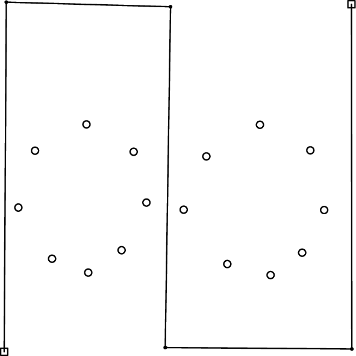
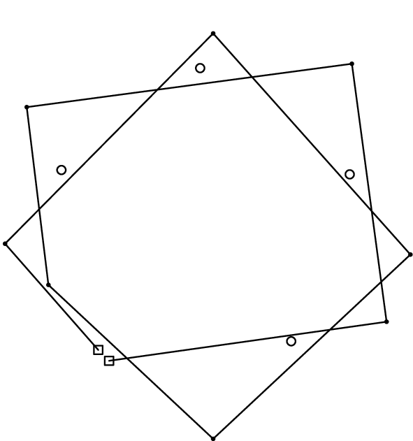
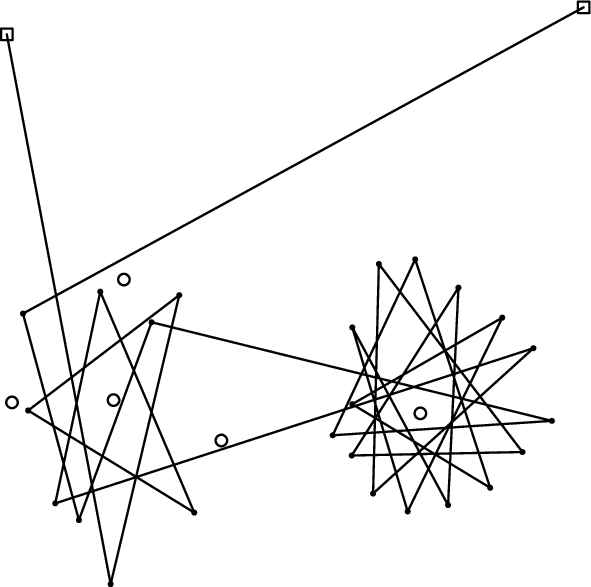
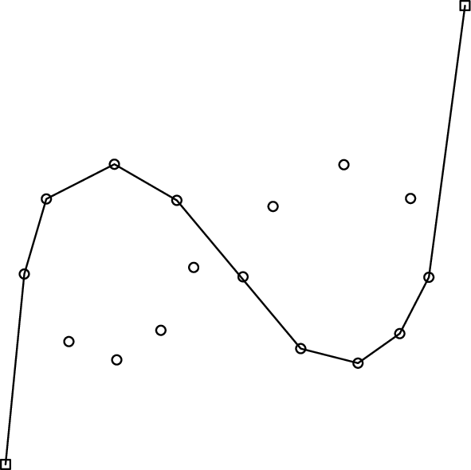
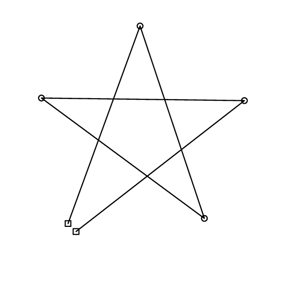
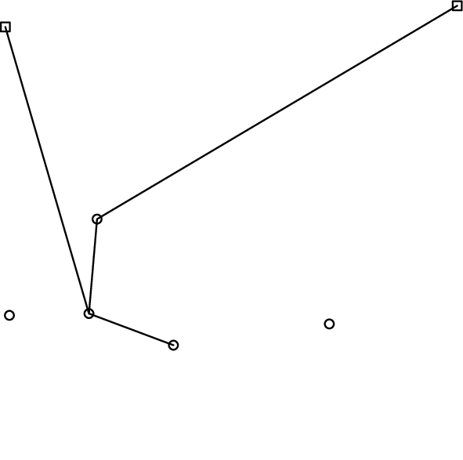

## 문제

We have a flat panel with two holes. Pins are nailed on its surface. From the back of the panel, a string comes out through one of the holes to the surface. The string is then laid on the surface in a form of a polygonal chain, and goes out to the panel's back through the other hole. Initially, the string does not touch any pins.

Figures F-1, F-2, and F-3 show three example layouts of holes, pins and strings. In each layout, white squares and circles denote holes and pins, respectively. A polygonal chain of solid segments denotes the string.



Figure F-1: An example layout of holes, pins and a string



Figure F-2: An example layout of holes, pins and a string



Figure F-3: An example layout of holes, pins and a string

When we tie a pair of equal weight stones to the both ends of the string, the stones slowly straighten the string until there is no loose part. The string eventually forms a different polygonal chain as it is obstructed by some of the pins. (There are also cases when the string is obstructed by no pins, though.)

The string does not hook itself while being straightened. A fully tightened string thus draws a polygonal chain on the surface of the panel, whose vertices are the positions of some pins with the end vertices at the two holes. The layouts in Figures F-1, F-2, and F-3 result in the respective polygonal chains in Figures F-4, F-5, and F-6. Write a program that calculates the length of the tightened polygonal chain.



Figure F-4: Tightened polygonal chains from the example in Figure F-1.



Figure F-5: Tightened polygonal chains from the example in Figure F-2.



Figure F-6: Tightened polygonal chains from the example in Figure F-3.

Note that the strings, pins and holes are thin enough so that you can ignore their diameters.

## 입력

The input consists of multiple datasets, followed by a line containing two zeros separated by a space. Each dataset gives the initial shape of the string (i.e., the positions of holes and vertices) and the positions of pins in the following format.

```

m n    
x1 y1 
... 
xl yl 
```

The first line has two integers m and n (2 ≤ m ≤ 100, 0 ≤ n ≤ 100), representing the number of vertices including two holes that give the initial string shape (m) and the number of pins (n). Each of the following l = m + n lines has two integers xi and yi (0 ≤ xi ≤ 1000, 0 ≤ yi ≤ 1000), representing a position Pi = (xi, yi) on the surface of the panel.

* Positions P1, ..., Pm give the initial shape of the string; i.e., the two holes are at P1 and Pm , and the string's shape is a polygonal chain whose vertices are Pi (i = 1, ..., m), in this order.
* Positions Pm+1, ..., Pm+n are the positions of the pins.

Note that no two points are at the same position. No three points are exactly on a straight line.

## 출력

For each dataset, the length of the part of the tightened string that remains on the surface of the panel should be output in a line. No extra characters should appear in the output.

No lengths in the output should have an error greater than 0.001.
