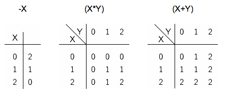

## 문제

3차 논리는 논리값이 "true", "false", "unknown"을 가지는 논리 체계이다. 이 체계에서는 "false"는 0의 값을 가지고, "unknown"은 1, "true"는 2의 값을 갖는다.

"-"을 단항 연산자, "\*"와 "+"는 이항 연산자라고 하자. 이 연산자는 각각 NOT, AND, OR을 의미한다. 3차 논리에서 3개 연산자는 다음과 같이 정의되어 있다.



P, Q, R을 3차 논리값을 갖는 변수라고 하자. 이때, 식이 주어졌을 때, 식의 값을 2로 만드는 (P,Q,R)쌍의 개수를 구하는 프로그램을 작성하시오. 식은 다음 중 하나의 형태를 갖는다. (X와 Y는 식을 의미한다)

* 상수: 0, 1, 2
* 변수: P, Q, R
* NOT: -X
* AND: (X\*Y)
* OR: (X+Y)

AND와 OR은 항상 괄호로 둘러싸여 있다.

예를 들어, (P\*Q)가 주어졌을 때, 식의 값을 2로 만드는 (P,Q,R)쌍은 (2,2,0), (2,2,1), (2,2,2) 3가지이다.

## 입력

입력은 여러 개의 테스트 케이스로 이루어져 있다. 각 테스트 케이스는 한 줄로 이루어져 있고, 식을 나타낸다. 식은 0, 1, 2, P, Q, R, -, \*, +, (, )로만 이루어져 있다.

식의 BNF형 문법은 다음과 같다.

```

<formula> ::= 0 | 1 | 2 | P | Q | R |
              -<formula> | (<formula>*<formula>) | (<formula>+<formula>)
```

입력은 80글자를 넘지 않는다. 마지막 줄에는 '.'이 주어진다.

## 출력

각 테스트 케이스에 대해서, 입력으로 주어진 식의 값을 2로 만드는 (P,Q,R) 쌍의 개수를 출력한다.
