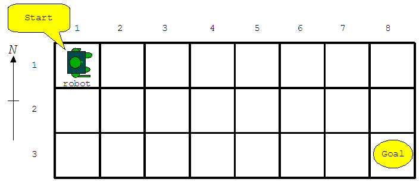
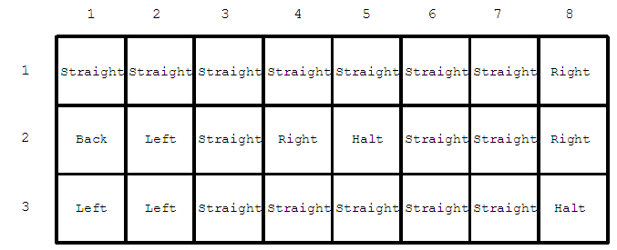

## 문제

Let's play a game using a robot on a rectangular board covered with a square mesh (Figure D-1). The robot is initially set at the start square in the northwest corner facing the east direction. The goal of this game is to lead the robot to the goal square in the southeast corner.



Figure D-1: Example of a board

The robot can execute the following five types of commands.

* "Straight": Keep the current direction of the robot, and move forward to the next square.
* "Right": Turn right with 90 degrees from the current direction, and move forward to the next square.
* "Back": Turn to the reverse direction, and move forward to the next square.
* "Left": Turn left with 90 degrees from the current direction, and move forward to the next square.
* "Halt": Stop at the current square to finish the game.

Each square has one of these commands assigned as shown in Figure D-2. The robot executes the command assigned to the square where it resides, unless the player gives another command to be executed instead. Each time the player gives an explicit command, the player has to pay the cost that depends on the command type.



Figure D-2: Example of commands assigned to squares

The robot can visit the same square several times during a game. The player loses the game when the robot goes out of the board or it executes a "Halt" command before arriving at the goal square.

Your task is to write a program that calculates the minimum cost to lead the robot from the start square to the goal one.

## 입력

The input is a sequence of datasets. The end of the input is indicated by a line containing two zeros separated by a space. Each dataset is formatted as follows.

```

w h
s(1,1) ... s(1,w)
s(2,1) ... s(2,w)
...
s(h,1) ... s(h,w)
c0 c1 c2 c3
```

The integers h and w are the numbers of rows and columns of the board, respectively. You may assume 2 ≤ h ≤ 30 and 2 ≤ w ≤ 30. Each of the following h lines consists of w numbers delimited by a space. The number s(i, j) represents the command assigned to the square in the i-th row and the j-th column as follows.

* 0: "Straight"
* 1: "Right"
* 2: "Back"
* 3: "Left"
* 4: "Halt"

You can assume that a "Halt" command is assigned to the goal square. Note that "Halt" commands may be assigned to other squares, too.

The last line of a dataset contains four integers c0, c1, c2, and c3, delimited by a space, indicating the costs that the player has to pay when the player gives "Straight", "Right", "Back", and "Left" commands respectively. The player cannot give "Halt" commands. You can assume that all the values of c0, c1, c2, and c3 are between 1 and 9, inclusive.

## 출력

For each dataset, print a line only having a decimal integer indicating the minimum cost required to lead the robot to the goal. No other characters should be on the output line.
