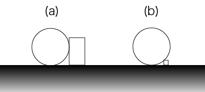

## 문제

ACM University holds its sports day in every July. The "Roll-A-Big-Ball" is the highlight of the day. In the game, players roll a ball on a straight course drawn on the ground. There are rectangular parallelepiped blocks on the ground as obstacles, which are fixed on the ground. During the game, the ball may not collide with any blocks. The bottom point of the ball may not leave the course.

To have more fun, the university wants to use the largest possible ball for the game. You must write a program that finds the largest radius of the ball that can reach the goal without colliding any obstacle block.

The ball is a perfect sphere, and the ground is a plane. Each block is a rectangular parallelepiped. The four edges of its bottom rectangle are on the ground, and parallel to either x- or y-axes. The course is given as a line segment from a start point to an end point. The ball starts with its bottom point touching the start point, and goals when its bottom point touches the end point.

The positions of the ball and a block can be like in Figure E-1 (a) and (b).



Figure E-1: Possible positions of the ball and a block

## 입력

The input consists of a number of datasets. Each dataset is formatted as follows.

```

N
sx sy ex ey
minx1 miny1 maxx1 maxy1 h1
minx2 miny2 maxx2 maxy2 h2
...
minxN minyN maxxN maxyN hN
```

A dataset begins with a line with an integer N, the number of blocks (1 ≤ N ≤ 50). The next line consists of four integers, delimited by a space, indicating the start point (sx, sy) and the end point (ex, ey). The following N lines give the placement of blocks. Each line, representing a block, consists of five integers delimited by a space. These integers indicate the two vertices (minx, miny), (maxx, maxy) of the bottom surface and the height h of the block. The integers sx, sy, ex, ey, minx, miny, maxx, maxy and h satisfy the following conditions.

* -10000 ≤ sx, sy, ex, ey ≤ 10000
* -10000 ≤ minxi < maxxi ≤ 10000
* -10000 ≤ minyi < maxyi ≤ 10000
* 1 ≤ hi ≤ 1000

The last dataset is followed by a line with a single zero in it.

## 출력

For each dataset, output a separate line containing the largest radius. You may assume that the largest radius never exceeds 1000 for each dataset. If there are any blocks on the course line, the largest radius is defined to be zero. The value may contain an error less than or equal to 0.001. You may print any number of digits after the decimal point.
