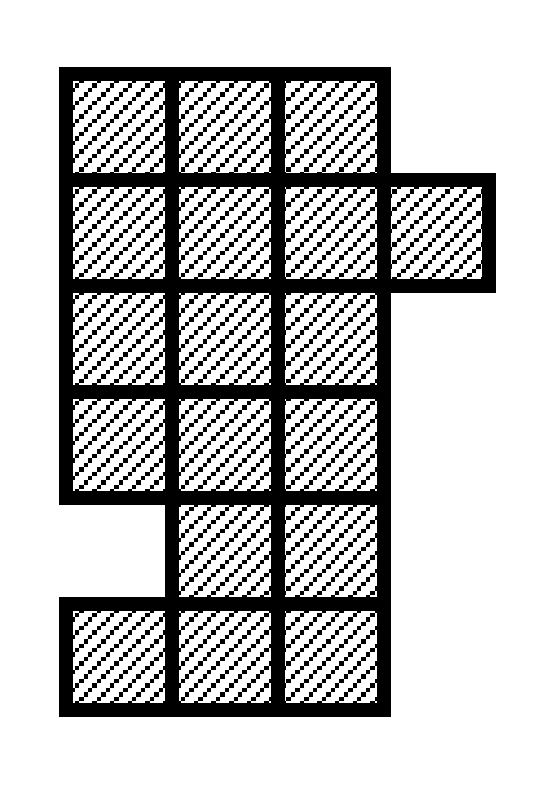
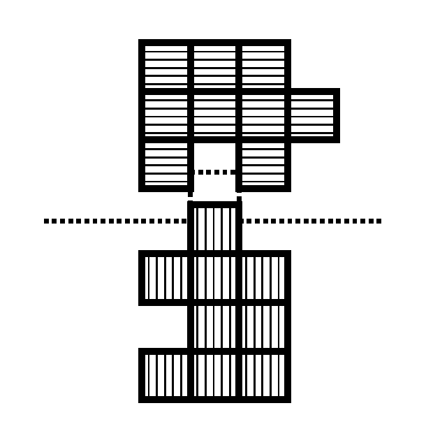
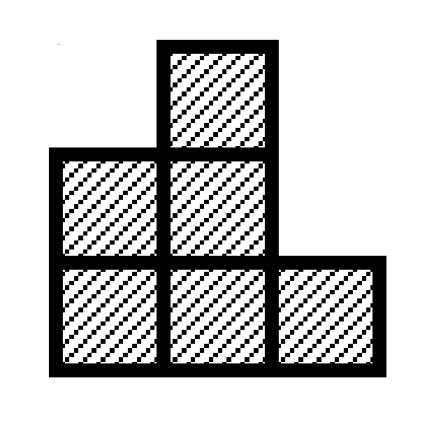
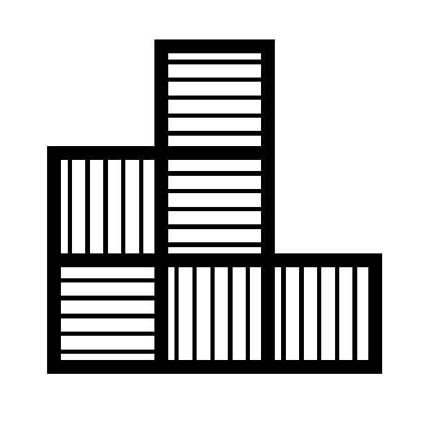
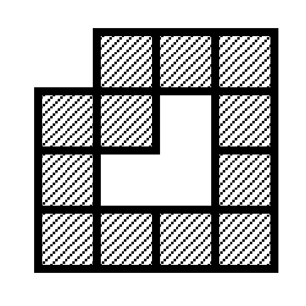

## 문제

The twins named Tatsuya and Kazuya love chocolate. They have found a bar of their favorite chocolate in a very strange shape. The chocolate bar looks to have been eaten partially by Mam. They, of course, claim to eat it and then will cut it into two pieces for their portions. Since they want to be sure that the chocolate bar is fairly divided, they demand that the shapes of the two pieces are congruent and that each piece is connected.

The chocolate bar consists of many square shaped blocks of chocolate connected to the adjacent square blocks of chocolate at their edges. The whole chocolate bar is also connected.

Cutting the chocolate bar along with some edges of square blocks, you should help them to divide it into two congruent and connected pieces of chocolate. That is, one piece fits into the other after it is rotated, turned over and moved properly.



Figure F-1: A partially eaten chocolate bar with 18 square blocks of chocolate

For example, there is a partially eaten chocolate bar with 18 square blocks of chocolate as depicted in Figure F-1. Cutting it along with some edges of square blocks, you get two pieces of chocolate with 9 square blocks each as depicted in Figure F-2.



Figure F-2: Partitioning of the chocolate bar in Figure F-1

You get two congruent and connected pieces as the result. One of them consists of 9 square blocks hatched with horizontal lines and the other with vertical lines. Rotated clockwise with a right angle and turned over on a horizontal line, the upper piece exactly fits into the lower piece.



Figure F-3: A shape that cannot be partitioned into two congruent and connected pieces

Two square blocks touching only at their corners are regarded as they are not connected to each other. Figure F-3 is an example shape that cannot be partitioned into two congruent and connected pieces. Note that, without the connectivity requirement, this shape can be partitioned into two congruent pieces with three squares (Figure F-4).



Figure F-4: Two congruent but disconnected pieces

Your job is to write a program that judges whether a given bar of chocolate can be partitioned into such two congruent and connected pieces or not.

## 입력

The input is a sequence of datasets. The end of the input is indicated by a line containing two zeros separated by a space. Each dataset is formatted as follows.

```

w h
r(1, 1) ... r(1, w)
r(2, 1) ... r(2, w)
... 
r(h, 1) ... r(h, w)
```

The integers w and h are the width and the height of a chocolate bar, respectively. You may assume 2 ≤ w ≤ 10 and 2 ≤ h ≤ 10. Each of the following h lines consists of w digits delimited by a space. The digit r(i, j) represents the existence of a square block of chocolate at the position (i, j) as follows.

* '0': There is no chocolate (i.e., already eaten).
* '1': There is a square block of chocolate.

You can assume that there are at most 36 square blocks of chocolate in the bar, i.e., the number of digit '1's representing square blocks of chocolate is at most 36 in each dataset. You can also assume that there is at least one square block of chocolate in each row and each column.

You can assume that the chocolate bar is connected. Since Mam does not eat chocolate bars making holes in them, you can assume that there is no dataset that represents a bar in a shape with hole(s) as depicted in Figure F-5.



Figure F-5: A partially eaten chocolate bar with a hole (You can assume that there is no dataset like this example)

## 출력

For each dataset, output a line containing one of two uppercase character strings "YES" or "NO". "YES" means the chocolate bar indicated by the dataset can be partitioned into two congruent and connected pieces, and "NO" means it cannot be partitioned into such two pieces. No other characters should be on the output line.
