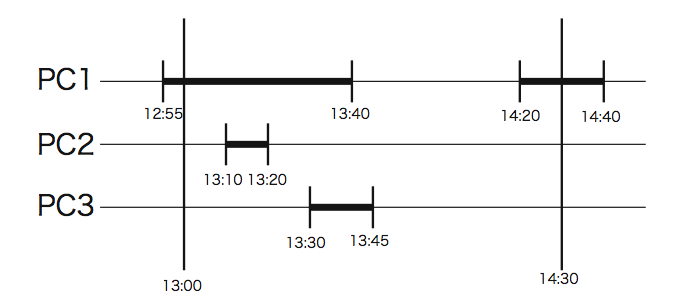

## 문제

You have a computer literacy course in your university. In the computer system, the login/logout records of all PCs in a day are stored in a file. Although students may use two or more PCs at a time, no one can log in to a PC which has been logged in by someone who has not logged out of that PC yet.

You are asked to write a program that calculates the total time of a student that he/she used at least one PC in a given time period (probably in a laboratory class) based on the records in the file.

The following are example login/logout records.

* The student 1 logged in to the PC 1 at 12:55
* The student 2 logged in to the PC 4 at 13:00
* The student 1 logged in to the PC 2 at 13:10
* The student 1 logged out of the PC 2 at 13:20
* The student 1 logged in to the PC 3 at 13:30
* The student 1 logged out of the PC 1 at 13:40
* The student 1 logged out of the PC 3 at 13:45
* The student 1 logged in to the PC 1 at 14:20
* The student 2 logged out of the PC 4 at 14:30
* The student 1 logged out of the PC 1 at 14:40

For a query such as "Give usage of the student 1 between 13:00 and 14:30", your program should answer "55 minutes", that is, the sum of 45 minutes from 13:00 to 13:45 and 10 minutes from 14:20 to 14:30, as depicted in the following figure.



## 입력

The input is a sequence of a number of datasets. The end of the input is indicated by a line containing two zeros separated by a space. The number of datasets never exceeds 10.

Each dataset is formatted as follows.

```

N M 
r 
record1
... 
recordr 
q 
query1
... 
queryq 
```

The numbers N and M in the first line are the numbers of PCs and the students, respectively. r is the number of records. q is the number of queries. These four are integers satisfying the following.

* 1 ≤ N ≤ 1000, 1 ≤ M ≤ 10000, 2 ≤ r ≤ 1000, 1 ≤ q ≤ 50

Each record consists of four integers, delimited by a space, as follows.

* t n m s

s is 0 or 1. If s is 1, this line means that the student m logged in to the PC n at time t. If s is 0, it means that the student m logged out of the PC n at time t. The time is expressed as elapsed minutes from 0:00 of the day. t , n and m satisfy the following.

* 540 ≤ t ≤ 1260, 1 ≤ n ≤ N , 1 ≤ m ≤ M

You may assume the following about the records.

* Records are stored in ascending order of time t.
* No two records for the same PC has the same time t.
* No PCs are being logged in before the time of the first record nor after that of the last record in the file.
* Login and logout records for one PC appear alternatingly, and each of the login-logout record pairs is for the same student.

Each query consists of three integers delimited by a space, as follows.

* ts te m

It represents "Usage of the student m between ts and te ". ts , te and m satisfy the following.

* 540 ≤ ts < te ≤ 1260, 1 ≤ m ≤ M

## 출력

For each query, print a line having a decimal integer indicating the time of usage in minutes. Output lines should not have any character other than this number.
