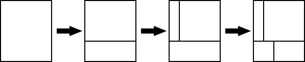

## 문제

Today is the birthday of Mr. Bon Vivant, who is known as one of the greatest pâtissiers in the world. Those who are invited to his birthday party are gourmets from around the world. They are eager to see and eat his extremely creative cakes. Now a large box-shaped cake is being carried into the party. It is not beautifully decorated and looks rather simple, but it must be delicious beyond anyone's imagination. Let us cut it into pieces with a knife and serve them to the guests attending the party.

The cake looks rectangular, viewing from above (Figure C-1). As exemplified in Figure C-2, the cake will iteratively be cut into pieces, where on each cut exactly a single piece is cut into two smaller pieces. Each cut surface must be orthogonal to the bottom face and must be orthogonal or parallel to a side face. So, every piece shall be rectangular looking from above and every side face vertical.


Figure C-1: The top view of the cake



Figure C-2: Cutting the cake into pieces

Piece sizes in Figure C-2 vary significantly and it may look unfair, but you don't have to worry. Those guests who would like to eat as many sorts of cakes as possible often prefer smaller pieces. Of course, some prefer larger ones.

Your mission of this problem is to write a computer program that simulates the cutting process of the cake and reports the size of each piece.

## 입력

The input is a sequence of datasets, each of which is of the following format.

```

n w d
p1 s1
...
pn sn
```

The first line starts with an integer n that is between 0 and 100 inclusive. It is the number of cuts to be performed. The following w and d in the same line are integers between 1 and 100 inclusive. They denote the width and depth of the cake, respectively. Assume in the sequel that the cake is placed so that w and d are the lengths in the east-west and north-south directions, respectively.

Each of the following n lines specifies a single cut, cutting one and only one piece into two. pi is an integer between 1 and i inclusive and is the identification number of the piece that is the target of the i-th cut. Note that, just before the i-th cut, there exist exactly i pieces. Each piece in this stage has a unique identification number that is one of 1, 2, ..., i and is defined as follows:

* The earlier a piece was born, the smaller its identification number is.
* Of the two pieces born at a time by the same cut, the piece with the smaller area (looking from above) has the smaller identification number. If their areas are the same, you may define as you like the order between them, since your choice in this case has no influence on the final answer.

Note that identification numbers are adjusted after each cut.

si is an integer between 1 and 1000 inclusive and specifies the starting point of the i-th cut. From the northwest corner of the piece whose identification number is pi, you can reach the starting point by traveling si in the clockwise direction around the piece. You may assume that the starting point determined in this way cannot be any one of the four corners of the piece. The i-th cut surface is orthogonal to the side face on which the starting point exists.

The end of the input is indicated by a line with three zeros.

## 출력

For each dataset, print in a line the areas looking from above of all the pieces that exist upon completion of the n cuts specified in the dataset. They should be in ascending order and separated by a space. When multiple pieces have the same area, print it as many times as the number of the pieces.
