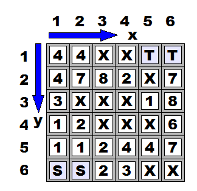
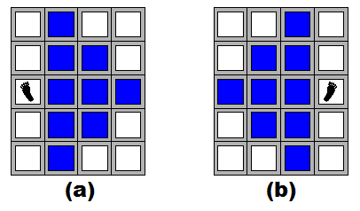

## 문제

At 17:00, special agent Jack starts to escape from the enemy camp. There is a cliff in between the camp and the nearest safety zone. Jack has to climb the almost vertical cliff by stepping his feet on the blocks that cover the cliff. The cliff has slippery blocks where Jack has to spend time to take each step. He also has to bypass some blocks that are too loose to support his weight. Your mission is to write a program that calculates the minimum time to complete climbing.

Figure D-1 shows an example of cliff data that you will receive. The cliff is covered with square blocks. Jack starts cliff climbing from the ground under the cliff, by stepping his left or right foot on one of the blocks marked with 'S' at the bottom row. The numbers on the blocks are the "slippery levels". It takes t time units for him to safely put his foot on a block marked with t, where 1 ≤ t ≤ 9. He cannot put his feet on blocks marked with 'X'. He completes the climbing when he puts either of his feet on one of the blocks marked with 'T' at the top row.



Figure D-1: Example of Cliff Data

Jack's movement must meet the following constraints. After putting his left (or right) foot on a block, he can only move his right (or left, respectively) foot. His left foot position (lx, ly) and his right foot position (rx, ry) should satisfy lx < rx and | lx - rx | + | ly - ry | ≤ 3. This implies that, given a position of his left foot in Figure D-2 (a), he has to place his right foot on one of the nine blocks marked with blue color. Similarly, given a position of his right foot in Figure D-2 (b), he has to place his left foot on one of the nine blocks marked with blue color.



Figure D-2: Possible Placements of Feet

## 입력

The input is a sequence of datasets. The end of the input is indicated by a line containing two zeros separated by a space. Each dataset is formatted as follows:

```

w h
s(1,1) ... s(1,w)
s(2,1) ... s(2,w)
...
s(h,1) ... s(h,w)
```

The integers w and h are the width and the height of the matrix data of the cliff. You may assume 2 ≤ w ≤ 30 and 5 ≤ h ≤ 60. Each of the following h lines consists of w characters delimited by a space. The character s(y, x) represents the state of the block at position (x, y) as follows:

* 'S': Jack can start cliff climbing from this block.
* 'T': Jack finishes climbing when he reaches this block.
* 'X': Jack cannot put his feet on this block.
* '1' - '9' (= t): Jack has to spend t time units to put either of his feet on this block.

You can assume that it takes no time to put a foot on a block marked with 'S' or 'T'.

## 출력

For each dataset, print a line only having a decimal integer indicating the minimum time required for the cliff climbing, when Jack can complete it. Otherwise, print a line only having "-1" for the dataset. Each line should not have any characters other than these numbers.
