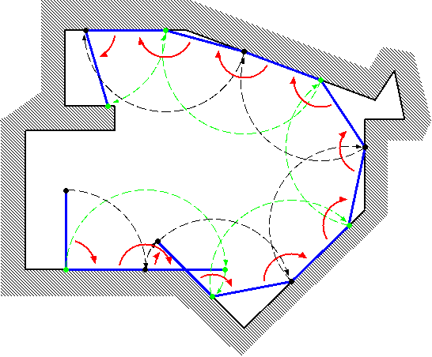
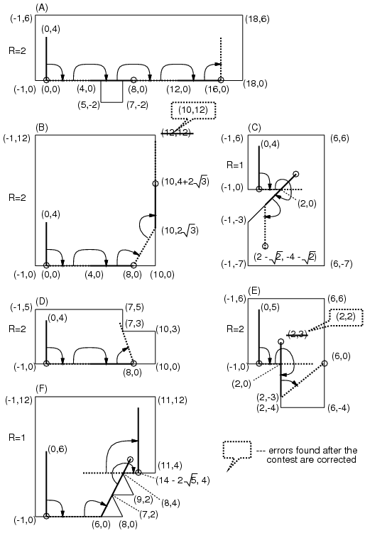

## 문제

Let's think about a bar rotating clockwise as if it were a twirling baton moving on a planar surface surrounded by a polygonal wall (see Figure 1).



Figure 1. A bar rotating in a polygon

Initially, an end of the bar (called "end A") is at (0,0), and the other end (called "end B") is at (0,L) where L is the length of the bar. Initially, the bar is touching the wall only at the end A.

The bar turns fixing a touching point as the center. The center changes as a new point touches the wall.

Your task is to calculate the coordinates of the end A when the bar has fully turned by the given count R.



Figure 2. Examples of turning bars

In Figure 2, some examples are shown. In cases (D) and (E), the bar is stuck prematurely (cannot rotate clockwise anymore with any point touching the wall as the center) before R rotations. In such cases, you should answer the coordinates of the end A in that (stuck) position.

You can assume the following:

When the bar's length L changes by ε (|ε| < 0.00001), the final (x,y) coordinates will not change more than 0.0005.

## 입력

The input consists of multiple datasets. The number of datasets is no more than 100. The end of the input is represented by "0 0 0".

The format of each dataset is as follows:

```

L R N
X1 Y1
X2 Y2
...
XN YN
```

L is the length of the bar. The bar rotates 2π× R radians (if it is not stuck prematurely). N is the number of vertices which make the polygon.

The vertices of the polygon are arranged in a counter-clockwise order. You may assume that the polygon is simple, that is, its border never crosses or touches itself.

N, Xi and Yi are integer numbers; R and L are decimal fractions. Ranges of those values are as follows:

* 1.0 ≤ L ≤ 500.0,
* 1.0 ≤ R ≤ 10.0,
* 3 ≤ N ≤ 100,
* -1000 ≤ Xi ≤ 1000,
* -1000 ≤ Yi ≤ 1000,
* X1 ≤ -1,  Y1 = 0,
* X2 ≥ 1,  Y2 = 0.

## 출력

For each dataset, print one line containing x- and y-coordinates of the final position of the end A, separated by a space. The value may contain an error less than or equal to 0.001. You may print any number of digits after the decimal point.
