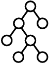
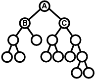
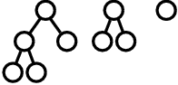
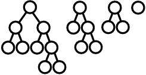
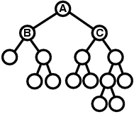
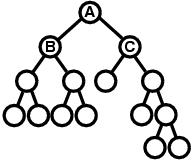

## 문제

After long studying how embryos of organisms become asymmetric during their development, Dr. Podboq, a famous biologist, has reached his new hypothesis. Dr. Podboq is now preparing a poster for the coming academic conference, which shows a tree representing the development process of an embryo through repeated cell divisions starting from one cell. Your job is to write a program that transforms given trees into forms satisfying some conditions so that it is easier for the audience to get the idea.

A tree representing the process of cell divisions has a form described below.

* The starting cell is represented by a circle placed at the top.
* Each cell either terminates the division activity or divides into two cells. Therefore, from each circle representing a cell, there are either no branch downward, or two branches down to its two child cells.

Below is an example of such a tree.



Figure F-1: A tree representing a process of cell divisions

According to Dr. Podboq's hypothesis, we can determine which cells have stronger or weaker asymmetricity by looking at the structure of this tree representation. First, his hypothesis defines "left-right similarity" of cells as follows:

1. The left-right similarity of a cell that did not divide further is 0.
2. For a cell that did divide further, we collect the partial trees starting from its child or descendant cells, and count how many kinds of structures they have. Then, the left-right similarity of the cell is defined to be the ratio of the number of structures that appear both in the right child side and the left child side. We regard two trees have the same structure if we can make them have exactly the same shape by interchanging two child cells of arbitrary some cells.

For example, suppose we have a tree shown below:



Figure F-2: An example tree

The left-right similarity of the cell A is computed as follows. First, within the descendants of the cell B, which is the left child cell of A, the following three kinds of structures appear. Notice that the rightmost structure appears three times, but when we count the number of structures, we count it only once.



Figure F-3: Structures appearing within the descendants of the cell B

On the other hand, within the descendants of the cell C, which is the right child cell of A, the following four kinds of structures appear.



Figure F-4: Structures appearing within the descendants of the cell C

Among them, the first, second, and third ones within the B side are regarded as the same structure as the second, third, and fourth ones within the C side, respectively. Therefore, there are four structures in total, and three among them are common to the left side and the right side, which means the left-right similarity of A is 3/4.

Given the left-right similarity of each cell, Dr. Podboq's hypothesis says we can determine which of the cells X and Y has stronger asymmetricity by the following rules.

1. If X and Y have different left-right similarities, the one with lower left-right similarity has stronger asymmetricity.
2. Otherwise, if neither X nor Y has child cells, they have completely equal asymmetricity.
3. Otherwise, both X and Y must have two child cells. In this case, we compare the child cell of X with stronger (or equal) asymmetricity (than the other child cell of X) and the child cell of Y with stronger (or equal) asymmetricity (than the other child cell of Y), and the one having a child with stronger asymmetricity has stronger asymmetricity.
4. If we still have a tie, we compare the other child cells of X and Y with weaker (or equal) asymmetricity, and the one having a child with stronger asymmetricity has stronger asymmetricity.
5. If we still have a tie again, X and Y have completely equal asymmetricity.

When we compare child cells in some rules above, we recursively apply this rule set.

Now, your job is to write a program that transforms a given tree representing a process of cell divisions, by interchanging two child cells of arbitrary cells, into a tree where the following conditions are satisfied.

1. For every cell X which is the starting cell of the given tree or a left child cell of some parent cell, if X has two child cells, the one at left has stronger (or equal) asymmetricity than the one at right.
2. For every cell X which is a right child cell of some parent cell, if X has two child cells, the one at right has stronger (or equal) asymmetricity than the one at left.

In case two child cells have equal asymmetricity, their order is arbitrary because either order would results in trees of the same shape.

For example, suppose we are given the tree in Figure F-2. First we compare B and C, and because B has lower left-right similarity, which means stronger asymmetricity, we keep B at left and C at right. Next, because B is the left child cell of A, we compare two child cells of B, and the one with stronger asymmetricity is positioned at left. On the other hand, because C is the right child cell of A, we compare two child cells of C, and the one with stronger asymmetricity is positioned at right. We examine the other cells in the same way, and the tree is finally transformed into the tree shown below.



Figure F-5: The example tree after the transformation

Please be warned that the only operation allowed in the transformation of a tree is to interchange two child cells of some parent cell. For example, you are not allowed to transform the tree in Figure F-2 into the tree below.



Figure F-6: An example of disallowed transformation

## 입력

The input consists of n lines (1≤n≤100) describing n trees followed by a line only containing a single zero which represents the end of the input. Each tree includes at least 1 and at most 127 cells. Below is an example of a tree description.

```

((x (x x)) x)
```

This description represents the tree shown in Figure F-1. More formally, the description of a tree is in either of the following two formats.

```

"(" <description of a tree starting at the left child> <single space> <description of a tree starting at the right child> ")"
```

or

```

"x"
```

The former is the description of a tree whose starting cell has two child cells, and the latter is the description of a tree whose starting cell has no child cell.

## 출력

For each tree given in the input, print a line describing the result of the tree transformation. In the output, trees should be described in the same formats as the input, and the tree descriptions must appear in the same order as the input. Each line should have no extra character other than one tree description.
