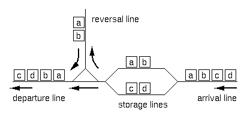

## 문제

RJ Freight, a Japanese railroad company for freight operations has recently constructed exchange lines at Hazawa, Yokohama. The layout of the lines is shown in Figure B-1.



Figure B-1: Layout of the exchange lines

A freight train consists of 2 to 72 freight cars. There are 26 types of freight cars, which are denoted by 26 lowercase letters from "a" to "z". The cars of the same type are indistinguishable from each other, and each car's direction doesn't matter either. Thus, a string of lowercase letters of length 2 to 72 is sufficient to completely express the configuration of a train.

Upon arrival at the exchange lines, a train is divided into two sub-trains at an arbitrary position (prior to entering the storage lines). Each of the sub-trains may have its direction reversed (using the reversal line). Finally, the two sub-trains are connected in either order to form the final configuration. Note that the reversal operation is optional for each of the sub-trains.

For example, if the arrival configuration is "abcd", the train is split into two sub-trains of either 3:1, 2:2 or 1:3 cars. For each of the splitting, possible final configurations are as follows ("+" indicates final concatenation position):

```

  [3:1]
    abc+d  cba+d  d+abc  d+cba
  [2:2]
    ab+cd  ab+dc  ba+cd  ba+dc  cd+ab  cd+ba  dc+ab  dc+ba
  [1:3]
    a+bcd  a+dcb  bcd+a  dcb+a
```

Excluding duplicates, 12 distinct configurations are possible.

Given an arrival configuration, answer the number of distinct configurations which can be constructed using the exchange lines described above.

## 입력

The entire input looks like the following.

```

the number of datasets = m
1st dataset 
2nd dataset 
... 
m-th dataset 
```

Each dataset represents an arriving train, and is a string of 2 to 72 lowercase letters in an input line.

## 출력

For each dataset, output the number of possible train configurations in a line. No other characters should appear in the output.
