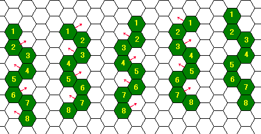
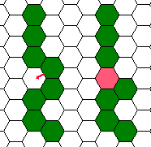
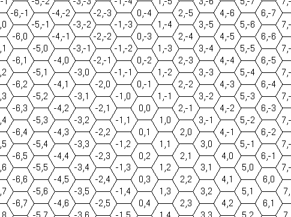

## 문제

Hexwamp is a strange swamp, paved with regular hexagonal dimples. Hexerpents crawling in this area are serpents adapted to the environment, consisting of a chain of regular hexagonal sections. Each section fits in one dimple.

Hexerpents crawl moving some of their sections from the dimples they are in to adjacent ones. To avoid breaking their bodies, sections that are adjacent to each other before the move should also be adjacent after the move. When one section moves, sections adjacent to it support the move, and thus they cannot move at that time. Any number of sections, as far as no two of them are adjacent to each other, can move at the same time.

You can easily find that a hexerpent can move its sections at its either end to only up to two dimples, and can move intermediate sections to only one dimple, if any.

For example, without any obstacles, a hexerpent can crawl forward twisting its body as shown in Figure C-1, left to right. In this figure, the serpent moves four of its eight sections at a time, and moves its body forward by one dimple unit after four steps of moves. Actually, they are much better in crawling sideways, like sidewinders.



Figure C-1: Crawling forward

Their skin is so sticky that if two sections of a serpent that are not originally adjacent come to adjacent dimples (Figure C-2), they will stick together and the serpent cannot but die. Two sections cannot fit in one dimple, of course. This restricts serpents' moves further. Sometimes, they have to make some efforts to get a food piece even when it is in the dimple next to their head.



Figure C-2: Fatal case

Hexwamp has rocks here and there. Each rock fits in a dimple. Hexerpents' skin does not stick to rocks, but they cannot crawl over the rocks. Although avoiding dimples with rocks restricts their moves, they know the geography so well that they can plan the fastest paths.

You are appointed to take the responsibility of the head of the scientist team to carry out academic research on this swamp and the serpents. You are expected to accomplish the research, but never at the sacrifice of any casualty. Your task now is to estimate how soon a man-eating hexerpent may move its head (the first section) to the position of a scientist in the swamp. Their body sections except for the head are quite harmless and the scientist wearing high-tech anti-sticking suit can stay in the same dimple with a body section of the hexerpent.

## 입력

The input is a sequence of several datasets, and the end of the input is indicated by a line containing a single zero. The number of datasets never exceeds 10.

Each dataset looks like the following.

```

the number of sections the serpent has (=n) 
x1 y1
x2 y2
...
xn yn
the number of rocks the swamp has (=k) 
u1 v1
u2 v2
...
uk vk
X Y
```

The first line of the dataset has an integer n that indicates the number of sections the hexerpent has, which is 2 or greater and never exceeds 8. Each of the n following lines contains two integers x and y that indicate the coordinates of a serpent's section. The lines show the initial positions of the sections from the serpent's head to its tail, in this order.

The next line of the dataset indicates the number of rocks k the swamp has, which is a non-negative integer not exceeding 100. Each of the k following lines contains two integers u and v that indicate the position of a rock.

Finally comes a line containing two integers X and Y, indicating the goal position of the hexerpent, where the scientist is. The serpent's head is not initially here.

All of the coordinates x, y, u, v, X, and Y are between −999999 and 999999, inclusive. Two integers in a line are separated by a single space. No characters other than decimal digits, minus signs, and spaces to separate two integers appear in the input. The coordinate system used to indicate a position is as shown in Figure C-3.



Figure C-3: The coordinate system

## 출력

For each dataset, output a line that contains a decimal integer that indicates the minimum number of steps the serpent requires for moving its head to the goal position. Output lines should not contain any other characters.

You can assume that the hexerpent can reach the goal within 20 steps.
