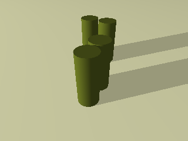
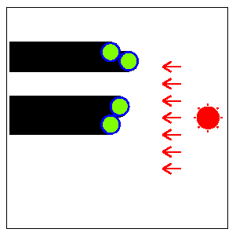
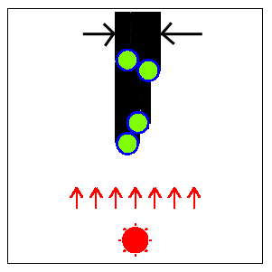
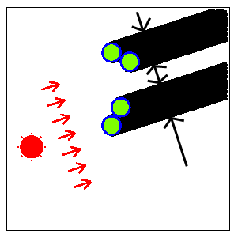
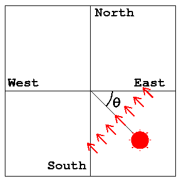
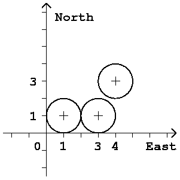

## 문제

Long long ago, there were several identical columns (or cylinders) built vertically in a big open space near Yokohama (Fig. F-1). In the daytime, the shadows of the columns were moving on the ground as the sun moves in the sky. Each column was very tall so that its shadow was very long. The top view of the shadows is shown in Fig. F-2.

The directions of the sun that minimizes and maximizes the widths of the shadows of the columns were said to give the important keys to the secrets of ancient treasures.



Fig. F-1: Columns (or cylinders)



Fig. F-2: Top view of the columns (Fig. F-1) and their shadows

The width of the shadow of each column is the same as the diameter of the base disk. But the width of the whole shadow (the union of the shadows of all the columns) alters according to the direction of the sun since the shadows of some columns may overlap those of other columns.

Fig. F-3 shows the direction of the sun that minimizes the width of the whole shadow for the arrangement of columns in Fig. F-2.



Fig. F-3: The direction of the sun for the minimal width of the whole shadow

Fig. F-4 shows the direction of the sun that maximizes the width of the whole shadow. When the whole shadow is separated into several parts (two parts in this case), the width of the whole shadow is defined as the sum of the widths of the parts.



Fig. F-4: The direction of the sun for the maximal width of the whole shadow

A direction of the sun is specified by an angle θ defined in Fig. F-5. For example, the east is indicated by θ=0, the south by θ=π/2, and the west by θ=π. You may assume that the sun rises in the east (θ=0) and sets in the west (θ=π).

Your job is to write a program that, given an arrangement of columns, computes two directions θmin and θmax of the sun that give the minimal width and the maximal width of the whole shadow, respectively.

The position of the center of the base disk of each column is specified by its (x,y) coordinates. The x-axis and y-axis are parallel to the line between the east and the west and that between the north and the south, respectively. Their positive directions indicate the east and the north, respectively.

You can assume that the big open space is a plane surface.



Fig. F-5: The definition of the angle of the direction of the sun

There may be more than one θmin or θmax for some arrangements in general, but here, you may assume that we only consider the arrangements that have unique θmin and θmax in the range 0<=θmin<π, 0<=θmax<π.

## 입력

The input consists of multiple datasets, followed by the last line containing a single zero.

Each dataset is formatted as follows.

```

n
x1 y1
x2 y2
...
xn yn
```

n is the number of the columns in the big open space. It is a positive integer no more than 100.

xk and yk are the values of x-coordinate and y-coordinate of the center of the base disk of the k-th column (k=1, ..., n). They are positive integers no more than 30. They are separated by a space.

Note that the radius of the base disk of each column is one unit (the diameter is two units). You may assume that some columns may touch each other but no columns overlap others.

For example, a dataset

```

3
1 1
3 1
4 3
```

corresponds to the arrangement of three columns depicted in Fig. F-6. Two of them touch each other.



Fig. F-6: An arrangement of three columns

## 출력

For each dataset in the input, two lines should be output as specified below. The output lines should not contain extra characters such as spaces.

In the first line, the angle θmin, the direction of the sun giving the minimal width, should be printed. In the second line, the other angle θmax, the direction of the sun giving the maximal width, should be printed.

Each angle should be contained in the interval between 0 and π (abbreviated to [0, π]) and should not have an error greater than ε=0.0000000001 (=10-10).

When the correct angle θ is in [0,ε], approximate values in [0,θ+ε] or in [π+θ-ε, π] are accepted. When the correct angle θ is in [π-ε, π], approximate values in [0, θ+ε-π] or in [θ-ε, π] are accepted.

You may output any number of digits after the decimal point, provided that the above accuracy condition is satisfied.
