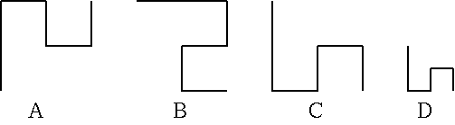

## 문제

Multiple polygonal lines are given on the xy-plane. Given a list of polygonal lines and a template, you must find out polygonal lines which have the same shape as the template.

A polygonal line consists of several line segments parallel to x-axis or y-axis. It is defined by a list of xy-coordinates of vertices from the start-point to the end-point in order, and always turns 90 degrees at each vertex. A single polygonal line does not pass the same point twice. Two polygonal lines have the same shape when they fully overlap each other only with rotation and translation within xy-plane (i.e. without magnification or a flip). The vertices given in reverse order from the start-point to the end-point is the same as that given in order.

Figure 1 shows examples of polygonal lines. In this figure, polygonal lines A and B have the same shape.

Write a program that answers polygonal lines which have the same shape as the template.



Figure 1: Polygonal lines

## 입력

The input consists of multiple datasets. The end of the input is indicated by a line which contains a zero.

A dataset is given as follows.

```

n
Polygonal line0
Polygonal line1
Polygonal line2
...
Polygonal linen
```

n is the number of polygonal lines for the object of search on xy-plane. n is an integer, and 1 <= n <= 50. Polygonal line0 indicates the template.

A polygonal line is given as follows.

```

m
x1 y1
x2 y2
...
xm ym
```

m is the number of the vertices of a polygonal line (3 <= m <= 10). xi and yi, separated by a space, are the x- and y-coordinates of a vertex, respectively (-10000 < xi < 10000, -10000 <yi < 10000).

## 출력

For each dataset in the input, your program should report numbers assigned to the polygonal lines that have the same shape as the template, in ascending order. Each number must be written in a separate line without any other characters such as leading or trailing spaces.

Five continuous "+"s must be placed in a line at the end of each dataset.
