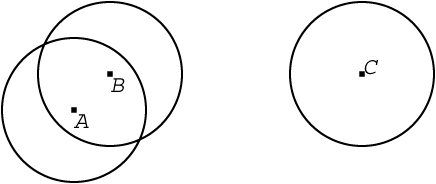
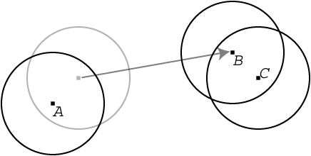
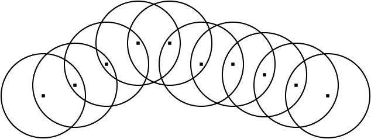

## 문제

A new type of mobile robot has been developed for environmental earth observation. It moves around on the ground, acquiring and recording various sorts of observational data using high precision sensors. Robots of this type have short range wireless communication devices and can exchange observational data with ones nearby. They also have large capacity memory units, on which they record data observed by themselves and those received from others.

Figure 1 illustrates the current positions of three robots A, B, and C and the geographic coverage of their wireless devices. Each circle represents the wireless coverage of a robot, with its center representing the position of the robot. In this figure, two robots A and B are in the positions where A can transmit data to B, and vice versa. In contrast, C cannot communicate with A or B, since it is too remote from them. Still, however, once B moves towards C as in Figure 2, B and C can start communicating with each other. In this manner, B can relay observational data from A to C. Figure 3 shows another example, in which data propagate among several robots instantaneously.



Figure 1: The initial configuration of three robots



Figure 2: Mobile relaying



Figure 3: Instantaneous relaying among multiple robots

As you may notice from these examples, if a team of robots move properly, observational data quickly spread over a large number of them. Your mission is to write a program that simulates how information spreads among robots. Suppose that, regardless of data size, the time necessary for communication is negligible.

## 입력

The input consists of multiple datasets, each in the following format.

```

N T R
nickname and travel route of the first robot
nickname and travel route of the second robot
...
nickname and travel route of the N-th robot
```

The first line contains three integers N, T, and R that are the number of robots, the length of the simulation period, and the maximum distance wireless signals can reach, respectively, and satisfy that 1 <=N <= 100, 1 <= T <= 1000, and 1 <= R <= 10.

The nickname and travel route of each robot are given in the following format.

```

nickname
t0 x0 y0
t1 vx1 vy1
t2 vx2 vy2
...
tk vxk vyk 
```

Nickname is a character string of length between one and eight that only contains lowercase letters. No two robots in a dataset may have the same nickname. Each of the lines following nickname contains three integers, satisfying the following conditions.

* 0 = t0 < t1 < ... < tk = T
* -10 <= vx1, vy1, ..., vxk, vyk<= 10

A robot moves around on a two dimensional plane. (x0, y0) is the location of the robot at time 0. From time ti-1 to ti (0 < i <= k), the velocities in the x and y directions are vxi and vyi, respectively. Therefore, the travel route of a robot is piecewise linear. Note that it may self-overlap or self-intersect.

You may assume that each dataset satisfies the following conditions.

* The distance between any two robots at time 0 is not exactly R.
* The x- and y-coordinates of each robot are always between -500 and 500, inclusive.
* Once any robot approaches within R + 10-6 of any other, the distance between them will become smaller than R - 10-6 while maintaining the velocities.
* Once any robot moves away up to R - 10-6 of any other, the distance between them will become larger than R + 10-6 while maintaining the velocities.
* If any pair of robots mutually enter the wireless area of the opposite ones at time t and any pair, which may share one or two members with the aforementioned pair, mutually leave the wireless area of the opposite ones at time t', the difference between t and t' is no smaller than 10-6 time unit, that is, | t - t' | >= 10-6.

A dataset may include two or more robots that share the same location at the same time. However, you should still consider that they can move with the designated velocities.

The end of the input is indicated by a line containing three zeros.

## 출력

For each dataset in the input, your program should print the nickname of each robot that have got until time T the observational data originally acquired by the first robot at time 0. Each nickname should be written in a separate line in dictionary order without any superfluous characters such as leading or trailing spaces.
