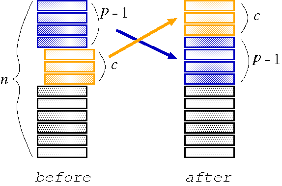

## 문제

There are a number of ways to shuffle a deck of cards. Hanafuda shuffling for Japanese card game 'Hanafuda' is one such example. The following is how to perform Hanafuda shuffling.

There is a deck of n cards. Starting from the p-th card from the top of the deck, c cards are pulled out and put on the top of the deck, as shown in Figure 1. This operation, called a cutting operation, is repeated.

Write a program that simulates Hanafuda shuffling and answers which card will be finally placed on the top of the deck.

Figure 1: Cutting operation

## 입력

The input consists of multiple data sets. Each data set starts with a line containing two positive integers n (1 <= n <= 50) and r (1 <= r <= 50); n and r are the number of cards in the deck and the number of cutting operations, respectively.

There are r more lines in the data set, each of which represents a cutting operation. These cutting operations are performed in the listed order. Each line contains two positive integers p and c (p + c <= n + 1). Starting from the p-th card from the top of the deck, c cards should be pulled out and put on the top.

The end of the input is indicated by a line which contains two zeros.

Each input line contains exactly two integers separated by a space character. There are no other characters in the line.

## 출력

For each data set in the input, your program should write the number of the top card after the shuffle. Assume that at the beginning the cards are numbered from 1 to n, from the bottom to the top. Each number should be written in a separate line without any superfluous characters such as leading or following spaces.
