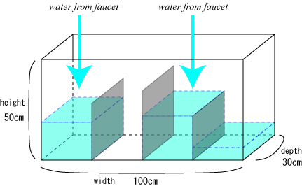
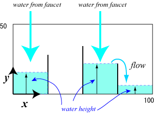

## 문제

Mr. Denjiro is a science teacher. Today he has just received a specially ordered water tank that will certainly be useful for his innovative experiments on water flow.



Figure 1: The water tank

The size of the tank is 100cm (Width) \* 50cm (Height) \* 30cm (Depth) (see Figure 1). For the experiments, he fits several partition boards inside of the tank parallel to the sideboards. The width of each board is equal to the depth of the tank, i.e. 30cm. The height of each board is less than that of the tank, i.e. 50 cm, and differs one another. The boards are so thin that he can neglect the thickness in the experiments.



Figure 2: The front view of the tank

The front view of the tank is shown in Figure 2.

There are several faucets above the tank and he turns them on at the beginning of his experiment. The tank is initially empty. Your mission is to write a computer program to simulate water flow in the tank.

## 입력

The input consists of multiple data sets. D is the number of the data sets.

```

D
DataSet1
DataSet2
...
DataSetD
```

The format of each data set (DataSetd , 1 <= d <= D) is as follows.

```

N
B1 H1
B2 H2
...
BN HN
M
F1 A1
F2 A2
...
FM AM
L
P1 T1
P2 T2
...
PL TL
```

Each line in the data set contains one or two integers.

N is the number of the boards he sets in the tank . Bi and Hi are the x-position (cm) and the height (cm) of the i-th board, where 1 <= i <= N .

Hi s differ from one another. You may assume the following.

* 0 < N < 10 ,
* 0 < B1 < B2 < ... < BN < 100 ,
* 0 < H1 < 50 , 0 < H2 < 50 , ..., 0 < HN < 50.

M is the number of the faucets above the tank . Fj and Aj are the x-position (cm) and the amount of water flow (cm3/second) of the j-th faucet , where 1 <= j <= M .

There is no faucet just above any boards . Namely, none of Fj is equal to Bi.

You may assume the following .

* 0 < M <10 ,
* 0 < F1 < F2 < ... < FM < 100 ,
* 0 < A1 < 100, 0 < A2 < 100, ... 0 < AM < 100.

L is the number of observation time and location. Pk is the x-position (cm) of the k-th observation point. Tk is the k-th observation time in seconds from the beginning.

None of Pk is equal to Bi.

You may assume the following .

* 0 < L < 10 ,
* 0 < P1 < 100, 0 < P2 < 100, ..., 0 < PL < 100 ,
* 0 < T1 < 1000000, 0 < T2 < 1000000, ... , 0 < TL < 1000000.

## 출력

For each data set, your program should output L lines each containing one real number which represents the height (cm) of the water level specified by the x-position Pk at the time Tk.

Each answer may not have an error greater than 0.001. As long as this condition is satisfied, you may output any number of digits after the decimal point.

After the water tank is filled to the brim, the water level at any Pk is equal to the height of the tank, that is, 50 cm.
