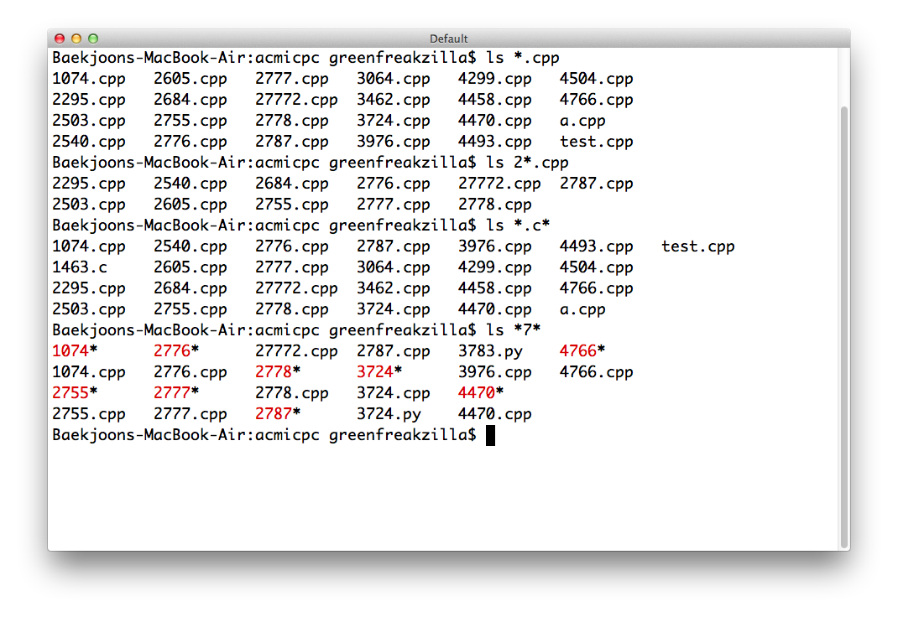

## 문제

현진이는 집에서 취미로 운영 체제를 만들고 있다. 오늘은 디렉토리 안의 파일 리스트를 보여주는 "ls"를 구현해야 할 차례이다. 현진이는 사용자들이 와일드카드(\*)를 이용해서 패턴과 일치한 파일 이름을 보여주게 하려고 한다. 와일드 카드는 어떤 문자의 0개 또는 그 이상에 해당한다.

## 입력

첫째 줄에 패턴 P가 주어진다. P는 1글자~100글자이고, 알파벳 소문자와 '.', '\*'로만 이루어져 있다. 둘째 줄에는 디렉토리의 파일 개수 N이 주어진다. (1 ≤ N ≤ 100) 다음 N개의 줄에는 디렉토리에 있는 파일의 이름이 한 줄에 하나씩 주어진다. 파일의 이름은 1글자~100글자이고, 알파벳 소문자와 '.'으로만 이루어져 있다.

## 출력

패턴 P와 일치하는 파일의 이름을 입력으로 주어진 순서를 따라서 한 줄에 하나씩 출력한다.
