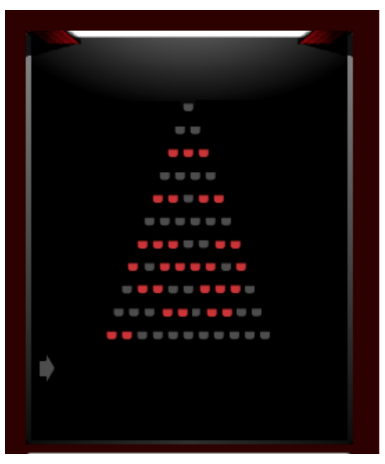

## 문제

People are going to the movies in groups (or alone), but normally only care to socialize within that group. Being Scandinavian, each group of people would like to sit at least one space apart from any other group of people to ensure their privacy, unless of course they sit at the end of a row. The number of seats per row in the cinema starts at X and decreases with one seat per row (down to a number of 1 seat per row). The number of groups of varying sizes is given as a vector (N1, . . . , Nn), where N1 is the number of people going alone, N2 is the number of people going as a pair etc. Calculate the seat-width, X, of the widest row, which will create a solution that seats all (groups of) visitors using as few rows of seats as possible. The cinema also has a limited capacity, so the widest row may not exceed 12 seats.

## 입력

The first line of input contains a single integer n (1 ≤ n ≤ 12), giving the size of the largest group in the test case.

Then follows a line with n integers, the i-th integer (1-indexed) denoting the number of groups of i persons who need to be seated.

## 출력

A single number; the size of the smallest widest row that will accommodate all the guests. If this number is greater than 12, output impossible instead.
