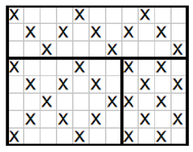

## 문제

상근이의 취미는 두들이다. 두들을 하려면 모눈종이가 필요하다. 두들은 가장 왼쪽 위 칸 (0,0)에서 시작한다. 매번 칸에 방문할 때 마다 상근이는 칸에 X를 채운다. (0,0)을 채운 다음에는 한 칸 오른쪽, 아래 (1,1)로 이동해서 X를 채운다. 이렇게 채워나가다가 종이의 모서리를 만나면, 반대방향으로 진행하고, 시작점으로 돌아올때까지 계속해서 X를 표시한다.

종이의 크기가 주어졌을 때, X를 표시한 서로 다른 칸의 수를 구하는 프로그램을 작성하시오.

## 입력

첫째 줄에 테스트 케이스의 개수 n(1 ≤ n ≤ 4000)이 주어진다. 각 테스트 케이스는 한 줄로 이루어져 있고, 모눈종이의 높이와 너비(칸의 수)가 주어진다. 두 숫자는 모두 2보다 크거나 같고, 20000보다 작거나 같은 자연수이다.

## 출력

각 테스트 케이스 마다, X를 채운 서로 다른 칸의 수를 출력한다.
