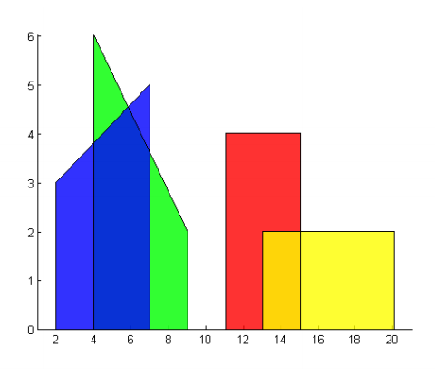

## 문제

Last time I visited Shanghai I admired its beautiful skyline. It also got me thinking, ”Hmm, how much of the buildings do I actually see?” since the buildings wholly or partially cover each other when viewed from a distance.

In this problem, we assume that all buildings have a trapezoid shape when viewed from a distance. That is, vertical walls but a roof that may slope. Given the coordinates of the buildings, calculate how large part of each building that is visible to you (i.e. not covered by other buildings).

## 입력

The first line contains an integer, N (2 ≤ N ≤ 100), the number of buildings in the city. Then follows N lines each describing a building. Each such line contains 4 integers, x1, y1, x2, and y2 (0 ≤ x1 < x2 ≤ 10000, 0 < y1, y2 ≤ 10000). The buildings are given in distance order, the first building being the one closest to you, and so on.

## 출력

For each building, output a line containing a floating point number between 0 and 1, the relative visible part of the building. The absolute error for each building must be < 10−6.

## 힌트

Figure 1: Figure of the first sample case
