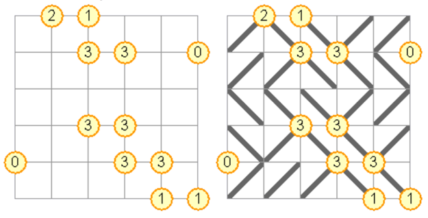

## 문제

Gokigen Naname는 일본 퍼즐 게임이다. 게임판은 정사각형 격자이고, 숫자가 쓰여 있는 동그라미가 일부 교차점에 있다.

게임의 목표는 격자의 모든 칸에 사선을 그어 모든 동그라미와 연결된 사선의 수가 동그라미 안에 있는 숫자와 일치하게 만드는 것이다. 또, 사선을 이용해서 닫힌 루프를 만들면 안 된다.

왼쪽 그림은 게임판이고, 오른쪽 그림은 왼쪽 퍼즐을 푼 상태이다. Gokigen Naname 퍼즐이 주어졌을 때, 퍼즐을 푸는 프로그램을 작성하시오. 항상 답이 유일한 경우만 주어진다.

## 입력

첫째 줄에 격자 한 변에 있는 칸의 수 n이 주어진다. (2 ≤ n ≤ 7)

다음 n+1개 줄에는 격자의 교차점 정보가 주어지며, 항상 n+1개 문자로 이루어져 있다. '.'인 경우는 교차점에 숫자가 없는 경우이다.

## 출력

퍼즐을 모두 푼 상태를 출력한다.
