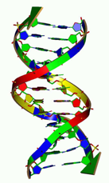

## 문제

상근이는 졸업 프로젝트로 DNA 복사를 시뮬레이션 하기로 했다.

DNA 문자열 S는 알파벳 {A, C, G, T}로만 이루어져 있다. 이때, DNA 문자열 T를 만들기 위해서 필요한 복사의 최소 횟수를 구하려고 한다. 복사는 S와 T의 일부에서 복사를 해야 하며, 뒤집어서 복사를 해도 된다. 하지만, 항상 연속된 부분만 복사를 할 수 있으며, 복사한 문자열은 항상 최종 T에 포함되어 있어야 한다.

예를 들어, S = "ACTG", T = "GTACTATTATA"인 경우를 살펴보자.

1. 먼저 S에서 "TG"를 복사한 다음 뒤집어서 붙여서 `GT.........`를 만든다.
2. S에서 AC를 복사해 `GTAC.......`를 만든다.
3. T의 일부인 TA를 복사해서 `GTAC...TA..`를 만든다.
4. T에서 TA를 복사한 다음 뒤집어서 붙여서 `GTAC...TAAT`를 만든다.
5. 마지막으로, T의 일부인 AAT를 복사해 `GTACAATTAAT`를 만든다.

## 입력

첫째 줄에 테스트 케이스의 개수 t가 주어진다. (1 ≤ t ≤ 100) 다음 줄에는 문자열 S가, 그 다음 줄에는 T가 주어진다. 주어지는 문자열의 길이는 모두 1보다 크거나 같고, 18보다 작거나 같다.

## 출력

각 테스트 케이스에 대해서 T를 만드는데 필요한 복사 횟수를 출력한다. 만약, 불가능한 경우에는 "impossible"을 출력한다.
