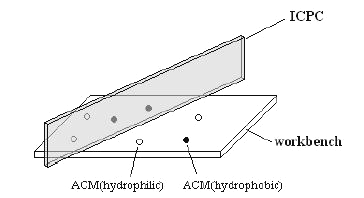
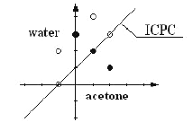

## 문제

Shanghai Hypercomputers, the world's largest computer chip manufacturer, has invented a new class of nanoparticles called Amphiphilic Carbon Molecules (ACMs). ACMs are semiconductors. It means that they can be either conductors or insulators of electrons, and thus possess a property that is very important for the computer chip industry. They are also amphiphilic molecules, which means parts of them are hydrophilic while other parts of them are hydrophobic. Hydrophilic ACMs are soluble in polar solvents (for example, water) but are insoluble in nonpolar solvents (for example, acetone). Hydrophobic ACMs, on the contrary, are soluble in acetone but insoluble in water. Semiconductor ACMs dissolved in either water or acetone can be used in the computer chip manufacturing process.

As a materials engineer at Shanghai Hypercomputers, your job is to prepare ACM solutions from ACM particles. You go to your factory everyday at 8 am and find a batch of ACM particles on your workbench. You prepare the ACM solutions by dripping some water, as well as some acetone, into those particles and watch the ACMs dissolve in the solvents. You always want to prepare unmixed solutions, so you first separate the ACM particles by placing an Insulating Carbon Partition Card (ICPC) perpendicular to your workbench. The ICPC is long enough to completely separate the particles. You then drip water on one side of the ICPC and acetone on the other side. The ICPC helps you obtain hydrophilic ACMs dissolved in water on one side and hydrophobic ACMs dissolved in acetone on the other side. If you happen to put the ICPC on top of some ACM particles, those ACMs will be right at the border between the water solution and the acetone solution, and they will be dissolved. Fig.1 shows your working situation.

Fig. 1

Your daily job is very easy and boring, so your supervisor makes it a little bit more challenging by asking you to dissolve as much ACMs into solution as possible. You know you have to be very careful about where to put the ICPC since hydrophilic ACMs on the acetone side, or hydrophobic ACMs on the water side, will not dissolve. As an experienced engineer, you also know that sometimes it can be very difficult to find the best position for the ICPC, so you decide to write a program to help you. You have asked your supervisor to buy a special digital camera and have it installed above your workbench, so that your program can obtain the exact positions and species (hydrophilic or hydrophobic) of each ACM particle in a 2D pictures taken by the camera. The ICPC you put on your workbench will appear as a line in the 2D pictures.

Fig. 2

## 입력

There will be no more than 10 test cases. Each case starts with a line containing an integer N, which is the number of ACM particles in the test case. N lines then follow. Each line contains three integers x, y, r, where (x, y) is the position of the ACM particle in the 2D picture and r can be 0 or 1, standing for the hydrophilic or hydrophobic type ACM respectively. The absolute value of x, y will be no larger than 10000. You may assume that N is no more than 1000. N = 0 signifies the end of the input and need not be processed. Fig.2 shows the positions of ACM particles and the best ICPC position for the last test case in the sample input.

## 출력

For each test case, output a line containing a single integer, which is the maximum number of dissolved ACM particles.
