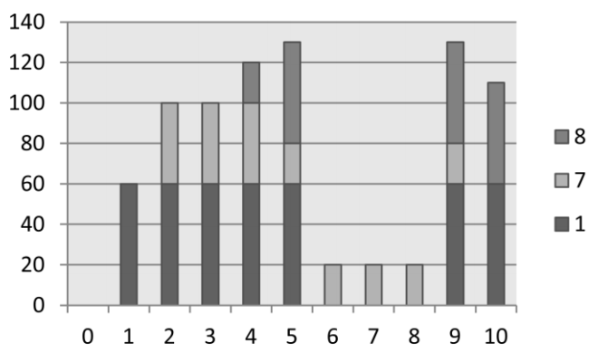

## 문제

In a study of domestic power consumption, researchers built a simulator for New Zealand homes. For each home the software simulates the power consumption of appliances. The goal of the project was to identify microspikes in power usage – short periods of time during which total power consumption rose above a specified limit.

Before a simulation starts all appliances are turned off (using no power). At various times during the simulation period appliances will increase or decrease their power usage. Every time this happens the simulator outputs a record with the appliance number, the time (seconds) since that appliance’s last change (or since the start of the simulation), and the change in power level (watts). For a given appliance, records are in order, but unfortunately the simulation was written in such a way that results for different appliances are randomly interleaved. In particular it cannot be assumed that a record for appliance A, written before a record for appliance B, reports an event on appliance A that occurred before B’s event.

Your task is to write a program to read files of appliance records, and count the number of microspikes that occur. For any given simulation you will be given a power threshold M and a time threshold S. A microspike occurs if the power level P satisfies P > M for a period of time T: 1 <= T <= S.

## 입력

Your input is data from a number of simulations. The data for each simulation begins with a line holding three integers (T, M and S), separated by single spaces. T is the total simulation time in seconds (0 <= T <= 100,000); M is the power threshold (0 <= M <= 109); and S is the time threshold (1 <= S <= 1000). A line with three zeroes ends the input. Following are N power change lines (0 <= N <= 1,000,000). Each holds three integers (a, t and p), again separated by single spaces: ‘a’ is the appliance number (1 <= a <= 100,000); ‘t’ is the time in seconds since that appliance’s last change (0 <= t <= T); and ‘p’ is the change in power level (-10,000 <= p <= 10,000). A line with three zeros indicates the end of data for that simulation.

You can assume that the power level of an appliance never goes negative, and that total power consumption never exceeds 1,000,000,000. A microspike is only counted if both increase from below to above the threshold and reduction to below or at the threshold are reported (At the end of simulation appliances may not have been turned off).

## 출력

For each simulation one line of output is required, with the number of microspikes observed.

## 힌트

Total power consumption for sample input. Labels on the horizontal axis are the times for the starts of the seconds represented by the bar. All power changes occur instantaneously at the start of a second. Note that the column at time 10 is not part of the simulation. It is included in the chart to show the power level that continues indefinitely after the simulation end.
