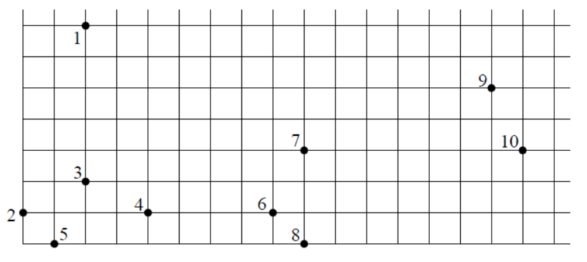

## 문제

One night, while camping out in the wide open spaces, Big Ed was looking at the stars. Now Ed never bothered to learn his constellations, but decided that grouping the stars was a reasonable thing to do after all. But Big Ed was going to do it in a sensible manner. He decided on the following simple rules:

* Every star is in the same constellation as its closest neighbor.
* If the closest neighbour is not unique, then the star and all its closest neighbours are in the same constellation.
* If A is in the same constellation as B, then B is in the same constellation as A.
* If A is in the same constellation as B, and B is in the same constellation as C, then A is in the same constellation as C.

For example, if the picture of the sky looked like the following:



Then there are 3 constellations: {1, 2, 3, 4, 5}, {6, 7, 8}, {9, 10}.

## 입력

Input will consist of a sequence of sky descriptions. Each begins with a single integer n: 0 < n ≤ 500 on a line, indicating the number of stars in the universe. The coordinates for the n stars follow as a pair x,y: 0 ≤ x ≤ 1000. A value of n = 0 indicates end of input.

## 출력

For each sky description, print a single line of the form

```

Sky s contains c constellations.
```

where s is the number of the sky description (starting at 1) and c is the number of constellations.
