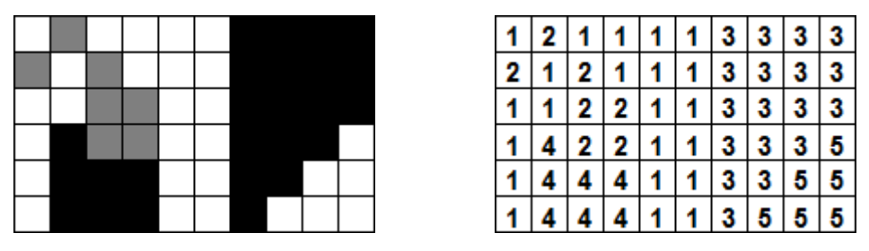

## 문제

You have been recruited to the staff of a medical imaging company. Your task is to build a test program as part of an image analysis system. Many devices produce pictures of structures inside the human body, like x-ray systems and ultrasonic scanners. A first step in automatic analysis of such images is to separate the image into connected areas, of like appearance or colour.

The way in which we define connected is most easily explained with a small artificial example. Consider the magnified 6 row by 10 column pixel image on the left below. There are three colours of pixel, white, grey and black. We consider two pixels of the same colour to be part of the same area if they are adjacent, horizontally, vertically or diagonally. So the set of 7 grey pixels form one connected area. In all there are 5 connected areas in this image. The areas are shown in the image to the right, where pixels in the same area have the same number.

Your task is to write a program which will examine an image and report the number of areas. There are some extra details to consider.

* Your image will be coloured. The pixel colour is recorded as a three vector (R, G, B) where values R, G, and B are integers in the range 0 to 255 inclusive.
* It turns out that real images rarely have regions of exactly one colour. Instead you will have to treat similar colours as though they were the same. This will be done by ‘banding’. With each image, you will be given a ‘band size’ S. This must be used to convert each colour value into a band number. For example: with S = 32, Red, Green or Blue values in the range 0..31(incl) will be taken as band 0, 32..63 will be band 1, etc. The colour (5, 32, 76) will be converted to a band number version (0, 1, 2). Two colours should be considered to be the same if they have the same band number form.
* For use in medical work, small areas can be ignored. For each image you will be given a size limit value L. You should not count areas that include less than L pixels.

## 입력

Input takes the form of a sequence of images. The data for each image starts with a line holding 4 integer values, separated by spaces: H W S L being image height, image width, band size and area size limit. W and H lie in the range 1 to 1024 (inclusive). This will be followed by H lines of data. Each line of data holds W triples, being the R, G and B values for successive pixels. Numbers are separated by single spaces. The end of input is denoted by a line with 4 zeroes.

## 출력

For each image, output a single line with the number of areas in the image (not counting those that are too small).
