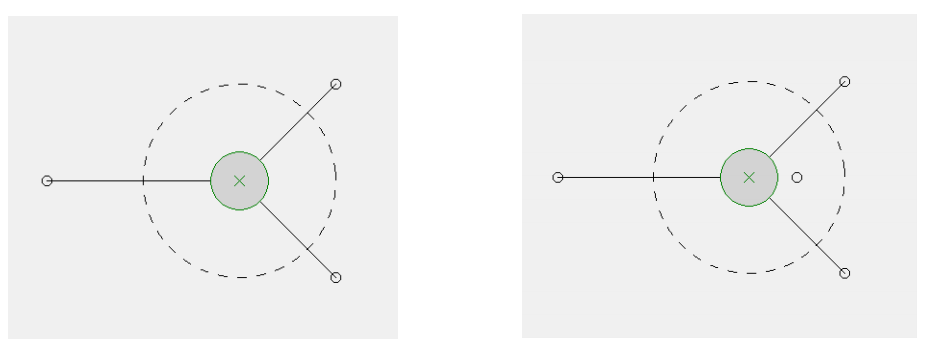

## 문제

You have been asked to help with the programming in a cooperative network game. The idea is that players cooperate in moving a bat (disk shape) around on a playing surface. When the whole game is finished there will be bouncing balls that can be hit with the bat when it is in a suitable position. For the moment we are just programming the bat movement. The game is played on a 1000 by 1000 unit board. Each player can position and move a pointer on the board. The pointer is connected by an elastic cord to the centre of the bat disk. The bat will move about as the pointer locations change, coming to rest in an equilibrium position, where the forces acting on it balance. Your task it to write a programme that takes pointer positions as input and outputs the position of the bat.

For example, as shown in the diagram there are pointers at (300, 400), (600, 300) and (600, 500). Each applies a force proportional to its distance from the centre of the bat, resulting in an equilibrium position of (500, 400) for the bat.

A complicating issue is that elastic cords have a minimum length, below which they cannot exert any force. In our system this minimum length is 100 units. Pointers closer than 100 units from the centre of the disk exert no force. In the image to the right a new point has been added at (550, 400). It is shown without a connecting line as it is exerting no force. (The dashed circle in the images shows the 100 unit limit.)

Fortunately a game world can violate proper physics. For this game the force applied by a pointer is proportional to its distance from the disk centre. The result can be some numerical instability when pointers are close to the 100 unit limit. For the purposes of this programming problem, you can assume that pointers do not finish close to the limit.

## 입력

Input will consist of a sequence of game situations. Each begins with a line holding a single integer n: 0 ≤ n ≤ 30 indicating the number of pointers. It is followed by one line for each pointer, holding its coordinates x, y: 0 ≤ x, y ≤ 1000 as two integers separated by a space. Input is terminated by a zero value of n.

## 출력

For each sky game situation, output one line with the equilibrium position of the centre of the disk, as shown in sample output. Coordinates should be rounded to the nearest integer value.
