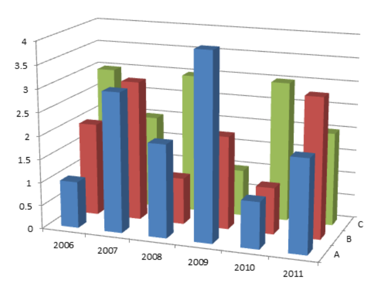
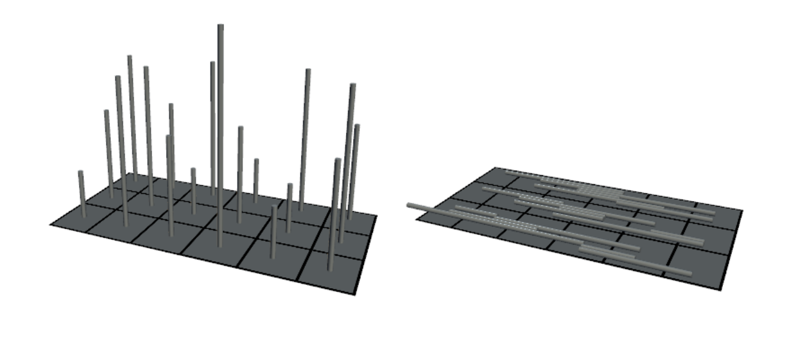
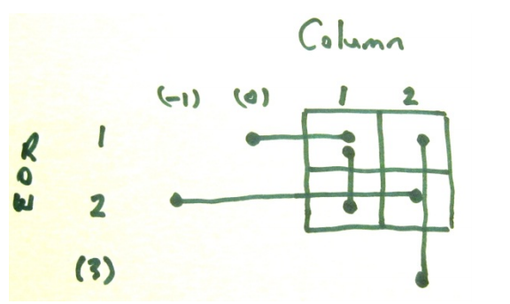
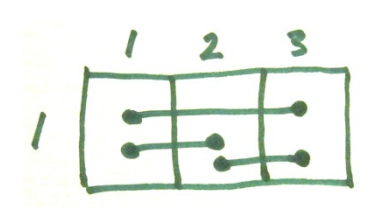

## 문제

For a special presentation to the Computer Game Developers association Mario made up a two dimensional histogram of showing number of game titles published by year and game genre. As displayed by his spreadsheet software it was quite attractive.

Mario decided that a physical model would be even better and built one from wire and cardboard – see left picture below. When packed for transport to the conference it looked like the right hand picture below. Each wire had been laid down, either to the left or right at random, while keeping its base in the correct square.

Only when he came to unpack and get his model set up again did he realise that there might be a problem. Whether each wire had been laid down to the left or to the right had not been recorded. Even worse, his assistant had not followed the packing instructions correctly. Not all wires had been laid left or right. Some had been laid forward and backward on the card. Of course the original data was not available. You have been asked to write software to figure out how to stand the wires up. In case the problem occurs again, you have been asked to make the software quite general.

Some problems will have solutions. For example, in the sketch to the right there are four pins of lengths 1, 1, 3 and 2. They can only stand up with the two length 1 pins in column 1; and the length 2 and 3 pins in column2 (rows 1 and 2 respectively).

Other problems will not have unique solutions. For example consider the second sketch. The three pins can be stood up with the length 2 pin either at the right or at the left. When there are multiple solutions in this way we cannot be sure as to which is correct, therefore we must state that there is no solution. Note however that it would not have been a problem if the length 2 pin was only 1 unit long. In that case we might not be sure which cell pins had originally occupied, but we would be sure that each cell had started with a pin of height one. That is ok.

## 입력

The input consists of a number of problems. Each problem starts with a line holding two numbers R, and C, the number of Rows and the number of columns of the grid. 1 <= R, C <= 100. This will be followed by R \* C lines. Each line will hold the grid coordinates of the two ends of a piece of wire as four numbers r1, c1, r2, c2. One end will be in its correct grid cell. The other end will be wherever its length dictates, as it was either horizontally or vertically laid down. Note that the ‘other end’ coordinates may lie outside the grid (see examples below). Wires always have integer lengths. Wire lengths lie in the range 1 .. 9 (inclusive). Input is terminated by a line with two zeroes.

## 출력

For each problem output one blank line. Then, for problems for which there is no unique solution, output “No solution”. For problems with a unique solution you should output R rows. Each row will have C numbers, giving the heights of the wires in each column. These numbers will be output without spaces.
