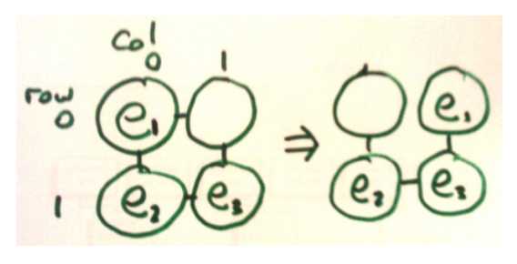

## 문제

You are God, building the universe. You're up to arranging the silicon crystals when you run into a problem. The silicon crystals are complaining that the aluminium impurities are stealing their electrons and are demanding their original electrons back. Luckily you've caught the problem early and the crystals you've been building are still small.

Unfortunately you can only move electrons by moving an electron from an atom with an electron to a connected neighbouring atom which is missing an electron. This can be a slow process--and as God you don't have a lot of time to spare--so you want to do it in the minimum number of moves.

For the purpose of this problem, you can think of the crystal lattice as a planar rectangular grid, with each atom connected to its 4 neighbours (up, down, left, right). You will be given a series of rectangular crystals with misplaced electrons, for which you have to find solutions. The atoms are numbered 0 to n- 1 (n is the number of atoms in the lattice). Atom number i\*width + j is at the position with row i and column j of the rectangular grid. The electrons are also from 1 to n-1. Your task is to move electrons to their corresponding (same number) atoms, with atom 0 ending up without an electron.

## 입력

Input will consist of a number of test cases. The first line of a test case will contain 2 integers h w (2 <= h,w <= 5, h\*w <= 10). The next h lines will each contain w integers, identifying the electron at that location on the crystal lattice. A 0 represents the missing electron.

"0 0" on a line by itself indicates the end of the input.

## 출력

For each test case, output on one line the minimum number of steps required to return all electrons to their corresponding atoms.

## 힌트

