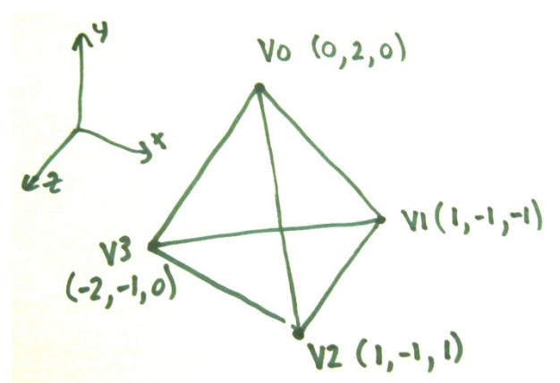
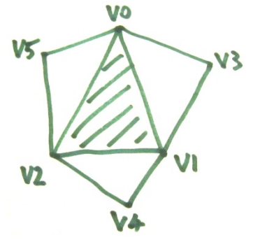

## 문제

Triangle adjacency is an issue that arises in Computer graphics. Modelling packages may output 3D models as a list of triangles. For example the tetrahedron shown in the sketch has 4 triangle shaped faces. Each triangle is described by listing the positions of its three corners (they are listed in clockwise order from the viewpoint of someone just outside the solid shape. A simple file format is shown in the Sample Input section below. The first line holds the number of triangles. The next three lines hold the x, y, z coordinates for the three corners of the first triangle, and so on

This is satisfactory for many purposes, but some graphics algorithms need to know which triangles are adjacent – ie: share edges. Your task here is to work this out for given models. The process of working out adjacent triangles also allows us to check that all triangle edges are properly adjacent to one other edge – this is a way of checking that a model is a fully enclosed shell, without gaps or holes.

In general, if you consider any face in a model, it can have up to three adjacent triangles, with each of which it shares one edge. Each edge in a well formed model occurs in exactly two triangles and the vertices of the edge occur in reverse order as you travel clockwise around each triangle. If we flatten a typical triangle and show its adjacent triangles we see something like this. If we know the centre triangle, we need only one extra vertex for each adjacent triangle. Knowing V0, V1 and V2; knowledge of V3 gives us the first adjacent triangle. The output format for this problem is based on this idea. For each triangle we output V0, V1, V2, V3, V4 and V5. In situations where there an adjacent triangle is missing, we output an X for the corresponding vertex.

## 입력

The input consists of a number of 3D models for which you need to compute triangle adjacency. The first line for each problem is a single integer T in the range 1 to 400000, being the number of triangles in the model. For each triangle three lines follow – giving a total of 3T lines. Each line holds three floating point values, being the x, y, z coordinates of a vertex, separated by a comma and a space. Vertices of a triangle are in clockwise order. Note that, although the sample data uses only integer coordinates, the judging data will use floating point values, including some in exponent form. The input is organised so that different occurrences of the same vertex will have identical floating point values (expressed as identical strings in the input). Otherwise all vertices are distinct when represented as single precision (32 bit) floats. All coordinates are in the range -2 to 2 (inclusive). Input is terminated by a line with a zero value.

## 출력

Distinct vertices should be numbered in the order in which they first occur in the input. Numbers start with zero and then are 1, 2, 3, etc. These vertex numbers will be output to identify each vertex, rather than using the coordinate values as in the input. Output for each model should consist of one blank line, followed by one line per triangle (ie: T lines). Triangle lines will be output in the same order as triangles were read from the input. Each line should have an integer, being the number of the triangle (0, 1, 2, …), then a colon ‘:’, a list of the vertex numbers of the sides of the triangle (in the same order as in the original input), and then the vertex numbers of the adjacent triangles’ third vertices in the order shown in the sketch above. Any missing adjacent index values should be output as upper case X’s. Values in the output should be separated by single space characters.
