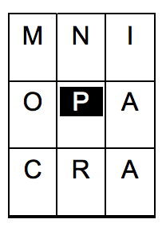

## 문제

An international newspaper, available in New Zealand, has a letter puzzle called Target. The puzzle presents a grid of 9 letters, from which participants are asked to make words of at least 4 letters. At least one of the words must contain all nine letters. The central letter in the grid must be contained in each word.

In the example shown, all words must contain the letter P. The solution the paper gave for this puzzle is:

```

apian apron camp campion capon carp corpa corp cramp crampon crimp
crop napa orpin pain pair panic panoramic para piano pica pion pram prana
prim prima primo prom ramp rampion romp
```

In this problem, you will be given a solution and asked to recreate the puzzle. In your answer, the letters of the puzzle must be arranged in alphabetical order except for the central required letter (P in this puzzle) which must be placed 5th in the list (ie in the middle). The puzzle above would be shown as

A A C I P M N O R

As stated, the required letter P is placed in the middle.

## 입력

Input will consist of a number of puzzles. Each puzzle starts with a single integer, N (2 < N <= 50) representing the number of words in the solution to the puzzle. The last line of input is the case where N = 0. This puzzle should not be processed.

Input for each puzzle will contain N words, each on a separate line. Words will be entirely in lower case and will contain between 4 and 9 letters. At least one word in each puzzle will contain 9 letters. All other words in the puzzle will contain only letters found in the 9 letter word, with no letter occurring more times in a single word than it occurs in the 9 letter word. There will be only 1 letter of the alphabet that occurs in every word.

## 출력

Output will be one line for each puzzle. That line will contain the 9 letters of the puzzle, in upper case and separated by spaces, arranged in alphabetical order except that the required letter will be placed in 5th place whatever its alphabetical position.
