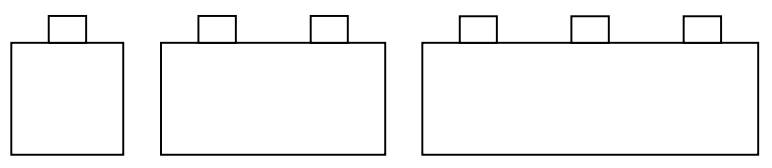
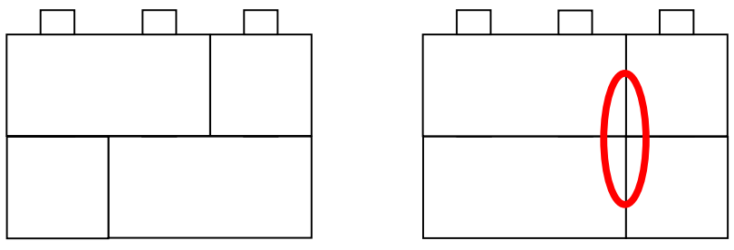
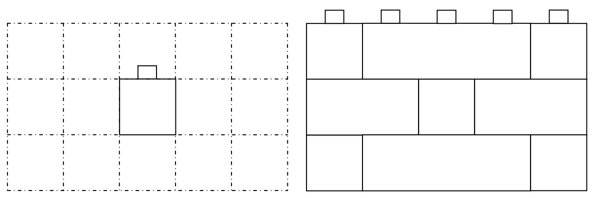

## 문제

You have just been employed by Lego Bricks Corporation and assigned to the team that writes instruction booklets. The senior members of your team design exciting new Lego models, but don’t have time to work out all the details. Your job is to check their partial models to see if it is possible to completely build them from the bricks in a given set. A common situation is making flat rectangular walls. This happens so often that there is value in writing a program to do the checking. Your program is check that it is possible to build rectangular walls from a given set of blocks of three kinds: R1, R2, and R3 respectively 1, 2 and 3 units wide.

Walls must obey the ‘brick’ rule – that the vertical joints between bricks must not be aligned. In the diagram below are two 2 by 3 (rows by columns) walls each made from 2 R1 and 2 R2 blocks. The left one obeys the brick rule; the right one does not (the oval marks the illegal vertical alignment).

For each wall you are asked to build you will be given the dimensions (number of rows and columns in Lego units), and also some known block locations that the designer has already determined (these occur as a result of connection of the wall to other parts of a model). When the wall is wide (> 10 columns), the designer is careful to determine most of the bricks along the top row. You will also be given a set of blocks from which the wall must be built.

Notes: You do not need to use all blocks in the set. The pre-determined blocks are not taken from the set.

Example: Build a 3 row by 5 column wall where there is known to be an R1 block at row 2, column 3. You have a set of 5 R1’s, 5 R2’s and 5 R3’s available. The problem and a solution are as follows. The solution uses 4 R1’s, 2 R2’s and 2 R3’s.

## 입력

Input consists of a number of problems. Each problem starts with a line holding the number of rows and the number of columns. Both lie in the range 1 to 30 (inclusive). 0, 0 signals the end of input. The second line for each problem holds three numbers – being the number of R1’s, the number of R2’s and the number of R3’s. The third line holds the number (N) of predefined blocks. N may be zero. Finally, there are N further lines of input. Each line specifies a predetermined block with a triple of numbers S, R, C. S is the size of the block (1, 2 or three). R and C give row and column numbers of its leftmost column. The top left corner of the wall has R = 1 and C = 1.

## 출력

One line of output per problem. The line should have the string “Yes” if a wall can be build; “No” otherwise.
