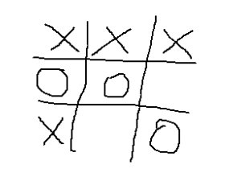
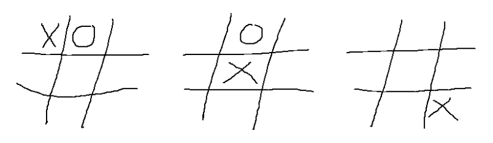
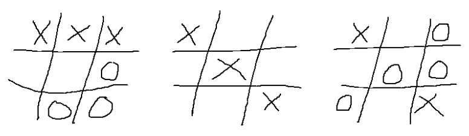

## 문제

Tic Tac Toe, (Naughts and Crosses) is a simple pencil and paper game played by children. The idea is that players take turns at drawing their symbol (O or X) in squares on a 3 by 3 grid. The first to get three of their symbols in a row (horizontal, vertical or diagonal) wins the game. If the grid is filled without either player making a line, the game is a draw. Here is a game that the X player has just won.



Unfortunately the game is rather limited. An interesting extension is to make it three dimensional – using 3 layers of 3 by 3. Real 3D requires some construction – plastic sets are available commercially. However it is possible to play a 3D game on paper, drawing three 2D grids and imagining them piled above each other. X wins again:



What about playing in 4, 5 or 6 dimensions? This is the basic idea of the game of Extreme Tic Tac Toe (ETTT), a game played by AI computers. ETTT scoring differs from normal Tic Tac Toe. Rather than stop as soon as one player achieves a line of their symbols, ETTT players play until the grid is full, or until they agree to stop. The winner is the one with the greatest number of lines of symbols. By ETTT rules, X would score 4 and O would score 1 in the following 3D game:



Your task is to write a program to read N-Dimensional ETTT game grids and work out the scores.

## 입력

The input consists of a series of input ETTT board configurations. Each board configuration starts with a line holding N, the dimension of this game (1 <= N <= 10). End of input is signaled by an N value of zero. That is followed by lines of X’s, O’x and ~’s for the cells of the game (~ represents an empty cell). Each line holds at least one, and no more than 40 symbols. To understand the order in which data is input, imagine the board being held in an N dimensional array. With N = 5, for example, the board could accessed as cell[a,b,c,d,e] or (cell[a][b][c][d][e] if your language doesn’t support the nicer syntax). The following pseudo-code would read the data in the correct order (ignoring line breaks).

```

for a = 1 to 3
   for b = 1 to 3
      for c = 1 to 3
         for d = 1 to 3
            for e = 1 to 3
               read cell[a,b,c,d,e]
```

## 출력

For each board configuration, output the scores for X and for O as shown in the sample data.
