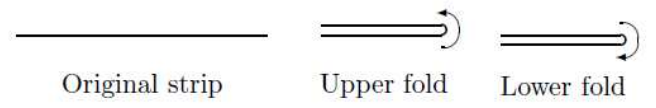
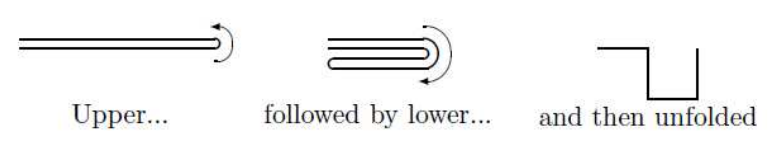

## 문제

Suppose you have a strip of paper and are given instructions to fold the paper in one of two ways: an upper fold, where the right. end of the paper is brought over to the top of the left end; and a. lower fold, where the right end of the paper is brought below the left end. The diagram below illustrates both types of folds.

Now, after meticulously folding the strip several times, you are asked to unfold it by making a 90 degree angle at each crease. The example below shows the result of an upper fold, followed by a lower fold and then an unfolding.

If the left end of the folded strip is placed at. the origin (0,0) and the first right. angle is at (1,0), it is natural to ask the questions: Where will the second right angle be located? The third right angle? Where will the other end of the strip be located? Well, that's for us to know and you to figure out.

## 입력

The input file will contain multiple test cases. The first line of the file will contain a single integer indicating the number of test cases. Each case will consist of a string of letters U and L indicating a series of upper and lower folds followed by an integer m. The length of the string will be between 1 and 30, inclusive. The value of m identifies a position on the paper. A value of m = 0 indicates the left end (at location (0,0)). If there are n folds, then a value of m = 2n indicates the right end of the strip. Any value for m between these two extremes represents one of the right angles; m = 1 indicates the first right angle, and so on.

## 출력

For each test case, output a single line of the form (x, y) indicating the location of the right angle (or end point.) specified by the problem. You should assume that if there are n folds in the test case, the length of the string is 2n so that the distance between creases is 1 unit long.
