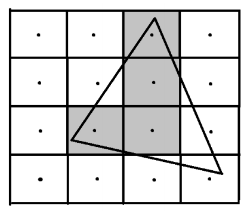
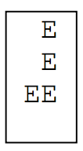
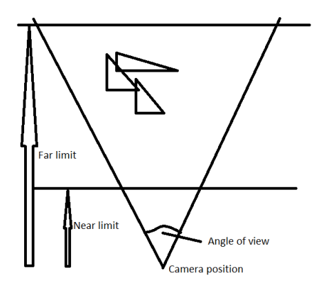
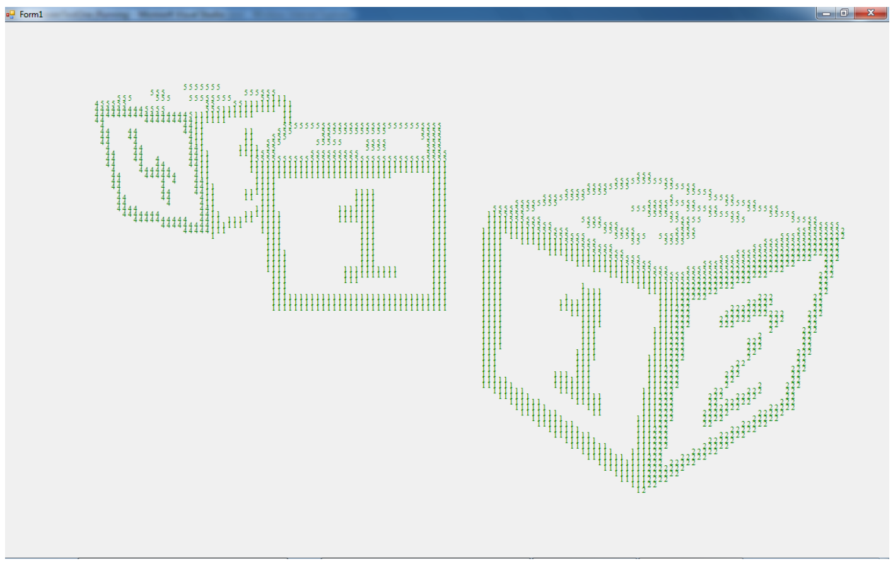

## 문제

Modern computers provide high quality graphics systems for games and other (less important) uses. But some computer users choose to forgo this image goodness and work with old fashioned monochrome text-only interfaces. For them Ascii art is the only option. As part of a project to implement Doom in Ascii, you have been asked to build an Ascii renderer.

The input will be a list of triangles and viewing information (as shown in the input section below). For each triangle you will be given the X, Y and Z coordinates of each vertex (in no particular order), and a ‘colour’. As the term ‘colour’ has little meaning in Ascii, we will interpret colour as meaning ‘character’. Ie: A triangle provided with the ‘colour’ ‘E’ will be rendered as an area of letter E’s on the screen.

The viewing information will include a ‘screen size’ – S – the number of rows and columns of characters that form an image (assume uniform letter spacing). For simplicity you will assume that an S by S block of characters is square - ie: that the ‘pixels’ are square. In practice the ‘images’ produced will probably look stretched vertically.

The coordinate system is right handed. Standing on the positive Z axis, looking towards the origin, positive Y is upward and positive X is to your right. You will be given a camera position, from which the scene is viewed; a ‘look at’ point – the point in the exact centre of the field of view, and an ‘up’ vector – indicating which way is up (ie: how you are rotating your camera about the line of view). All images will be produced with up being generally in the positive Y direction. You will never be required to produce an image viewing straight up or down.

## 입력

You will be asked to render a number of scenes. Each scene starts with a line holding two integers: S and T. S is the screen size (0 <= S <= 40) and T is the number of triangles to be rendered. (0 < T <= 20). S and T values of 0 terminate input. Next are T lines of input, each holding a triangle definition as: a single character (colour – which will not be a white space character); and 9 floats being coordinates of the three vertices of the triangle in order X1 Y1 Z1 X2 Y2 Z2 X3 Y3 Z3. All input items on a line are separated by single spaces. Following is a line with three floats. The X Y Z coordinates of the camera position. Then a line with X Y Z coordinates of the ‘look at’ point. Finally a last line with perspective data – the angle of view (degrees) and the distance to the near and far viewing limits (see diagram).

## 출력

For each problem output a blank line; a line of S asterisks; the rendered image; and another line of S asterisks.

Notes: You can assume that all triangles lie fully inside the viewing volume defined by the angle of view and the near and far viewing limits. Triangle display should respect the fact that near triangles obscure far triangles. Test data has been chosen to avoid exact alignment with pixel centres, so calculation to standard precision float levels should produce consistent results.

## 힌트

