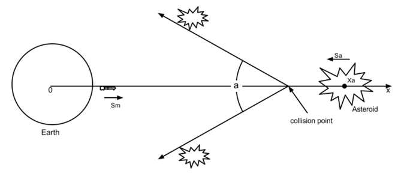

## 문제

There’s an asteroid headed for earth! If we’re clever, we might be able to avoid a catastrophe. Unfortunately at this time, we can only see part of it, the rest is blocked by the sun. So we must plan for an asteroid of unknown size moving at an unknown speed. On the plus side, we have missiles! But since we don’t know much about the asteroid, it is unclear when we should fire. When the missiles hit the asteroid, the asteroid will split into two pieces. The pieces will move away from each other at an angle determined by the size of the asteroid. We must fire the missiles soon enough in order to make sure that the pieces will miss the earth, which has a radius of 6,378.1 km. Given the angle at which the pieces will move, and the speed of the initial asteroid, we would like to know how much time is left until it is too late to fire the missiles.

## 입력

The first line is the number K of input data sets, followed by the K data sets, each of the following form:

There are four numbers: xa the position of the asteroid in kilometers, which will be greater than the radius of the earth (the earth is at position 0), 0 < a < 180 the angle in degrees at which the two asteroid pieces will separate, sa > 0 the constant speed of the asteroid in kilometers per second, sm > 0 the constant speed of our missiles in kilometers per second.

## 출력

For each data set, output “Data Set x:” on a line by itself, where x is its number. On the next line, output the number of seconds left before it’s too late to fire the missiles, assuming we fire them from the earth’s surface. Round the output to two decimal places. If there is less than 0.00 seconds left, output “Oh no!”. Each data set should be followed by a blank line.
