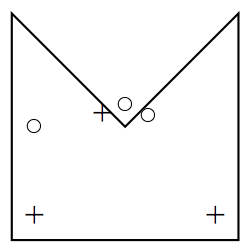

## 문제

Electrical Engineers like to think about the constructions of electrical and electronic devices, and the communication infrastructure between them. Lately, a lot of focus has been on computing devices and their connections. In particular, a lot of electrical engineers care about wireless networks. Here, we are going to look at a simplified version of the problem of providing wireless coverage to an area.

The area will be described as a polygon, by a sequence of corners. It is surrounded by walls. In addition, we are given the location of one or more wireless routers. Our simplified model of wireless connectivity is as follows2. If there is a wall in the straight line from a router to a location, then the location cannot get any signal at all from that router, and the signal strength is 0. If there is no wall, then the strength of the signal is 1/d2, where d is the distance between the router and the location. If a location gets a signal from multiple routers, we only count the strongest signal. You are to find the signal strength for several locations.

2It ignores reflection of signals from walls, and penetration of walls.

## 입력

The first line contains a number K ≥ 1, which is the number of input data sets in the file. This is followed by K data sets of the following form: The first line of a data set contains three numbers n, r, p, the number of corners of the polygon, the number of routers, and the number of points at which you are to evaluate signal strengths. All numbers will be between 1 and 100.

This is followed by n lines, each describing a corner, as a pair x, y of floating point numbers. Next are r lines, each describing a location of a router as a pair x, y of floating point numbers. Finally, p lines describe the point locations, as pairs x, y of floating point numbers.

We will make sure that (1) no routers or points lie exactly on a building wall, (2) no router and point are in the same location, and (3) no line from a router to a point just touches a wall (either it really intersects it, or completely avoids it).

The example input +: router, o: location

## 출력

For each data set, first output “Data Set x:” on a line by itself, where x is its number. Then, for each of the p points, on a line by itself, output the maximum signal strength at that point, rounded to two decimals.
