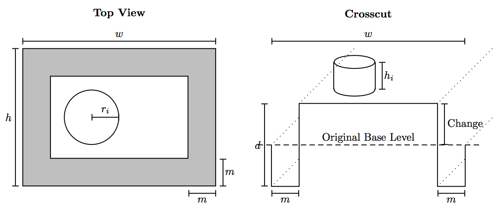

## 문제

It is pretty amazing what beautiful constructions one can build out of just sand and a bit of water. In fact, it is so amazing that A.-L. Barabasi has several publications in high-quality scientific journals about it.

We won’t be quite as ambitious here. All we want is a few cylindric towers (conveniently formed by little beach buckets) on a nice plain patch of sand, with a little rectangular moat around it. But Ah!, there’s a catch. You cannot just steal sand from a neighboring patch, or dispose of excess sand there.3 That means that if you want a very deep moat relative to the castle, you will probably have to raise the “base level”, whereas if your mote is shallow, and you have a lot of “buildings”, then your base level will be lower than on neighboring patches. You are to find out just how many centimeters the base level is raised or lowered.

3You may think that this is a silly rule. In fact, it sometimes applies to building projects in the real world. One of the constraints when the Getty Center was built was that they were not allowed to add or remove soil from the patch of land. That would explain those weird round towers at the corners — they are added ornaments to hide excess soil.

## 입력

The first line contains a number K ≥ 1, which is the number of input data sets in the file. This is followed by K data sets of the following form:

The first line of each data set contains numbers w, h, m, d, b. w and h are the width and height of your patch in centimeters (real numbers). m is the width of your moat (thus, m < 1/2 min(h, w)), and d is the depth of the moat, also in centimeters (also real numbers). Assume that the moat is always built at the perimeter of your patch. Finally, the integer number 0 ≤ b ≤ 100 is the number of “buildings” you build.

This is followed by b lines, each containing two numbers hi and ri. Here, the number hi is the height of the ith building (or bucket you used), and ri is the radius. You can assume that all buildings are cylindrical — for our purpose, it makes no difference if they are stacked on top of each other, or built next to each other. (Also, you need not worry about the case that the base area of a building is larger than the remaining area of your patch.)

Here are two pictures, viewed from the top and as a crosscut, illustrating the quantities.

## 출력

For each data set, first output “Data Set x:” on a line by itself, where x is its number. Then, output the total change in the level of your patch, in centimeters, and rounded to two decimals. (If the level of your patch is lowered, then output it with a negative sign, of course.)
