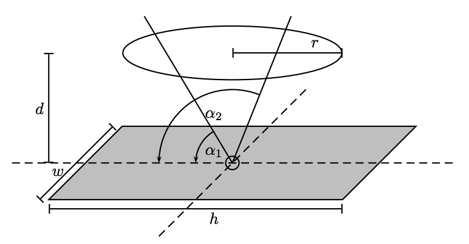

## 문제

Based on empirical observations, it appears that despite the many exciting things to do at the beach, the favorite of most people is just to lie in the sand. As you are all aware, prolonged exposure to sun can cause painful sunburns, so the use of sunscreen is highly recommended. Another approach pursued by many peopl  is to lie under a parasol, protecting them from rays. But if you know from when to when you will lie at the beach, where should you place the parasol to protect as much of your body as possible? 4

Here, we will answer a slightly easier question. Given the position of your body and the parasol, calculate which percentage of your body is exposed to the sun for at least part of the time. For simplicity, we will treat your body as rectangular, of size h × w centimeters. We treat the beach as a two-dimensional plane, with the origin at the center of your body. The parasol is assumed to be a circle of radius r, mounted horizontally at distance d above your body, with the center at the origin as well. You are sunbathing for a period from α1 to α2, where 1◦ ≤ α1 < α2 ≤ 179◦ are the angle that the sun makes with the beach at the beginning and end of your sunbath. (Assume that the sun is a point infinitely far away from the Earth, and travels straight from the left to the right.)

4In a French student science competition, one winning entry was a “para-tournesol”, a “sunflower parasol”. Using a light sensor, the parasol moves as the sun does, protecting you as much as possible. We won’t explore that avenue here.

## 입력

The first line contains a number K ≥ 1, which is the number of input data sets in the file. This is followed by K data sets of the following form:

Each data set consists of a single line, containing (in this order) the real numbers w, h, r, d, α1, α2.

Here is a figure illustrating these quantities. Notice that the sun travels “from your feet to your head”, and not “from your left arm to your right arm”.

## 출력

For each data set, first output “Data Set x:” on a line by itself, where x is its number. Then, output the percentage of your body that will be exposed to sun rays at some time, rounding to two decimals.
