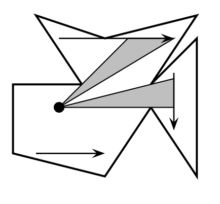

## 문제

Most of you have probably had lectures or seen talks in one of the classrooms (like OHE studios) which have multiple displays of the same screen, which is used for PowerPoint or other presentations. The reason is obvious: often enough, a pillar, or the head of the person in front of you, partially or completely obstructs the view of one screen, and you have a better chance of seeing everything if there are multiple copies. But just how much of the content does one see, depending on the seating position?

Here’s how we can model this. We’ll ignore people’s heads, and just focus on architectural obstruction. The lecture hall is given to you as a closed and simple polygon (i.e., walls don’t cross). In addition, you are given multiple positions of screens as lines in 2D, and your own position within the polygon. For each screen, you may see some or all of it from your position. Now, if you take the union of the contents you see, we want to calculate just how much content you get. For instance, if you see the left half of one screen and the right half of another, you see 100%. But if you see the left half of both, you only see 50% of the content. Also, if you see a screen from the back (meaning that its right side is to your left), then you can’t see any of the contents.

In the picture on the right, the thick lines are the walls of the lecture hall. The arrows depict the screens, and point from the left to the right side. The gray shaded areas denote your view cone, and where they meet the arrow is the screen area you can see. Notice that the screen below the person is oriented the wrong way, so it is not visible. In the example on the right, you can see 90% (all but the leftmost 10%) of the screen. The input data corresponding to this example is given below.

## 입력

The first line contains a number K ≥ 1, which is the number of input data sets in the file. This is followed by K data sets of the following form:

The first line of the data set contains four numbers n, m, x, y. 3 ≤ n ≤ 100 is the number of corner points of the polygon. 1 ≤ m ≤ 20 is the number of screens in the room, and (x, y) is your seating position (x and y are real numbers).

This is followed by n lines, each containing two real numbers (xi, yi). These are the positions of the ith corner point of the classroom. That means that there are walls from point (xi, yi) to (xi+1, yi+1) for all i, as well as a wall from (xn, yn) to (x1, y1).

Finally, there are m lines, each containing four real numbers (ℓxj, ℓyj),(rxj, ryj), which are the x- and ycoordinates of the left and right endpoints of the jth screen.

## 출력

For each data set, first output “Data Set x:” on a line by itself, where x is its number. Then, output the percentage of content that you can see, rounded to two decimals.
