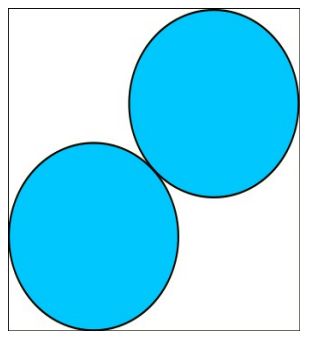

## 문제

We will consider a convex polygon with N vertices. We wish to find the maximum radius R such that two circles of radius R can be placed entirely inside the polygon without overlapping.

## 입력

The first line of input contains the number N. Each of the next N lines contains a pair of integers xi, yi – representing the coordinates of the ith point, separated by space.

## 출력

You should output a single number R – the desired radius. Output R with a precision of 3 decimals. You will pass a test if the output differs from the true answer by at most 0.001.

## 힌트

The maximum radius is obtained when the centers of the two circles are placed on one of the square's diagonals. The radius can be calculated exactly and it is:

\(\dfrac{\sqrt{2}}{2 \times (1 + \sqrt{2})} \approx 0.293\)

