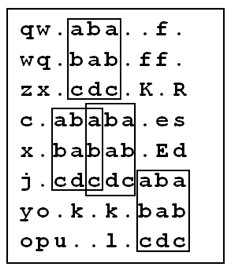

## 문제

While doing a routine exploration of the Universe, the Balkan Space Agency (BSA) guys have found traces of extraterrestrial (ET) intelligence.

More exactly, they have found a collection of rectangular metal plates containing messages written in the ET’s language. Each plate contains a 2D array with n rows and m columns, each element of the array being a printable ASCII character with the corresponding numeric code in the range 32 … 127. Also, each plate contains two more integers, which we will name a and b.

After studying the plates, the specialists of BSA have concluded that the ET's messages can be decrypted by using a cipher, e.g. a key which unveils the way to understand the message, which is hidden right into the rectangular array of that same plate.

The researchers have found out that the cipher is the rectangular subarea of the message, having the size of a rows by b columns that appears exactly k times, k ≥ 3. The subareas of the message which contain the cipher might overlap. It is also known that no other subarea of a rows by b columns in the metal plate can appear more than k - 2 times.

For example, if the rectangular array in the plate has a size of 8 × 10, e.g. n = 8 and m = 10 , and the cipher appears 5 times on the plate (k = 5), and its size is 3 × 3 (a = 3, b = 3), no other 3 × 3 subarray of this array will appear more than 3 times.

You are asked to write a program that, given the rectangular array which represents the ET’s message and the integers a and b which are written on the plate, finds the cipher and the positions on the plate where it can be found.

## 입력

The first line of input contains the integers n and m, separated by a blank character. Then n lines follow, each containing one m characters long string. The i’th line represents the i’th line of the rectangular array written on the plate. The last line of the file contains the integers a and b, separated by a blank.

## 출력

The first line of output must contain the integers a and b, separated by a blank. These numbers should be exactly equal to the ones found in the input file. Each of the next a lines of the text should contain a b characters long string, representing the cipher you have found. The next line of the output file must contain the integer k, the number of instances of the cipher you have found in the array. Then k lines of text should follow, each containing two integers delimited by a blank. These two numbers must represent the (row, column) position of the upper-left corner of the instances of the cipher you have found in the array. You may output the pairs in any order.

## 힌트

The array and the 4 instances of the cipher on it are shown below:

