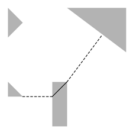

## 문제

The financial crisis in Greece has major consequences for the Greeks, especially for those who live on one of the many islands. Some of them can not even afford to travel from one island to another by boat. They avoid having to go to another island as much as possible, but if they really must, they have to swim.

Since swimming is very exhausting and potentially dangerous, they would like to minimize the distance they have to swim as much as possible. In that regard, swimming directly from island A to B may not be the best option. Instead, it might be more beneficial to swim from A to C, then cross island C on foot, before swimming from C to B. The ideal travel plan could in fact involve a lot of islands.

You are given a collection of islands, modeled as simple polygons. Determine, for two given islands, the smallest possible total distance one needs to swim in order to get from the one island to the other. The total distance covered on land is of no importance.

## 입력

On the first line one positive number: the number of test cases, at most 100. After that per test case:

* one line with one integer n (2 ≤ n ≤ 50): the number of islands.
* one line with two space-separated integers s and d (1 ≤ s, d ≤ n; s ≠ d): the islands that are the start and destination of the intended journey, respectively.
* per island:
* one line with one integer m (3 ≤ m ≤ 50): the number of vertices of the polygon describing the island.
* m lines with two space-separated integers xi and yi (-10 000 ≤ xi, yi ≤ 10 000): the coordinates of the i-th vertex of the polygon.

The polygons (islands) are non-self-intersecting and do not overlap or touch each other. The vertices of the polygons are given in counterclockwise order.

## 출력

Per test case:

* one line with one floating point number: the minimum distance one needs to swim in order to get from the start to the destination, rounded to three decimal places.

The test cases are such that an absolute error of at most 10-6 in the final answer does not influence the result of the rounding.

## 힌트

The island group as described by the second test case in the sample input. Indicated is the optimal path from the bottom left island to the top right one, which is the path that minimizes the total distance covered over water (indicated by the dashed lines).
