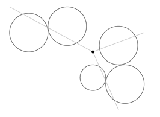

## 문제

John loves programming contests. There is just one problem: his team is not very good at programming. This usually doesn’t bother him, but what does bother him is that everyone gets a balloon for every correct submission. John’s team never gets any balloons, while other teams get one balloon after the other. This frustrates him, so John would like to see that all other teams have no balloons either.

This year he has a plan to achieve just that. John has hired a ninja to pop all balloons for him. At any time during the contest, he can call for the ninja to come down through a hole in the ceiling and pop all balloons by using his shurikens (ninja stars), before leaving through the hole in the ceiling again. Of course the ninja wants to use as few of his precious shurikens as possible. Therefore, John must write a program that computes how many shurikens are needed to pop all balloons. Because all balloons are usually at approximately the same height, he can model the problem as a 2-dimensional problem. He sets the location of the ninja (where he comes in) as the origin (0, 0) and uses circles to model the balloons. To be on the safe side, these circles can have different radii. Shurikens are assumed to be thrown from the origin and move in a straight line. Any circle/balloon crossed by this halfline will be popped by this shuriken. The question then becomes: how many halflines rooted at the origin are necessary to cross all circles?

Of course, as mentioned above, John is not a very good programmer, so he asks you to make this program for him. Can you help him out? You might get a balloon if you get it right...

## 입력

The first line of the input contains a single number: the number of test cases to follow. Each test case has the following format:

* One line with a single integer n (0 ≤ n ≤ 1, 000): the number of balloons.
* n lines, each containing three integers xi, yi (-104 ≤ xi, yi ≤ 104), and ri (1 ≤ ri ≤ 104), describing the circle used to model the ith balloon, where (xi, yi) is the center of the circle and ri is the radius.

You can assume that two lines (rooted at the origin) that are tangent to two distinct circles make an angle of at least 10-6 radians at the origin. Furthermore, the circles do not cross each other (but can touch) and do not contain the origin.

## 출력

For every test case in the input, the output should contain one integer on a single line: the minimum number of shurikens the ninja needs to pop all balloons.

## 힌트

Figure 1: Second sample case

**Disclaimer**

No balloons were harmed during the making of this problem.
