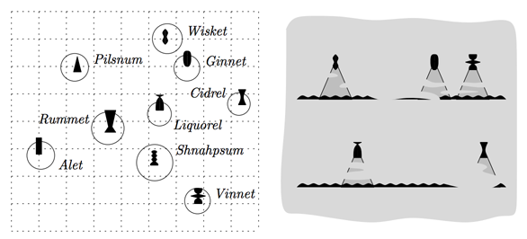

## 문제

안녕! 난 몽키 D. 루피라고 해! 해적왕이 될 남자지! 우리는 며칠 전에 드디어 전설의 보물 원피스가 숨겨진 섬을 표시해 둔 보물지도를 손에 넣었어! 원피스가 뭐냐고? 에이 참, 그것도 모르다니... 전설의 해적왕 골 D. 로저가 숨겨놓은 보물이라구! 여튼, 이 보물지도를 보고 우리는 그 섬이 어딘지 찾아가야 해!

보물섬이 위치해 있는 해안은 아주 작은 섬들이 굉장히 많이 있다고 들었어. 그래서 섬을 하나하나 뒤져보는 건 너무 오래 걸린다구! 그런데 이 보물지도 좀 이상해. 보통 생각하는 조감 시점의 보물지도가 아니라, 보물섬의 정상에서 바닷가를 바라보았을 때 어떤 섬들이 보이는지만 그려놓았어. 이건 워낙에 그 바다가 위험천만하고 재해가 많이 일어나서였나 봐.

예를 들면 왼쪽 그림이 실제 섬들의 위치이고, 오른쪽이 보물지도야. 보물지도에서 왼쪽에 그려진 섬은 실제로도 보물섬의 정상에서 바라보았을 때 왼쪽에 있다는 뜻이야. 그런데 그림을 그린 사람이 실력이 형편없었는지 두 섬이 떨어진 거리는 실제 보는 것과 차이가 심하다고 해. 게다가 이 해안이 안개까지 짙어서 실제로 안개에 가려서 보이지 않은 섬들은 그려지지도 않았어. 다행히 시력은 좋아서 180도 전방을 다 그려냈고, 섬마다 정확한 표식을 해 놓아서 그 섬이 어떤 섬인지는 확실히 알 수 있어.

만약 보물섬이 Rummet이었다고 치자면, Rummet에서 동쪽을 바라보았을 때 첫 번째 보물지도처럼 왼쪽부터 Wisket, Ginnet, Vinnet 섬 순으로 보일 것이고, 아니면 Liquorel, Cidrel 섬들이 보일 수도 있어. 아까 말했듯이 안개 때문에 몇몇 섬들이 그려지지 않은데다가, 실제로 볼 때 이 섬들 사이의 거리와 지도상에 그려진 거리는 아주 다르고 들쑥날쑥하지?

하지만 우리는 이제 보물지도뿐 아니라 그 해안에 어떤 섬이 있는지를 아주 정확히 나타내는 조감 시점의 지도도 찾았어! 이 지도들을 갖고 보물섬이 어딘지 찾아내서 기필코 해적왕이 되고 말 거야! 보물섬을 찾아낼 수 있겠어?

## 입력

첫 번째 줄에는 테스트 케이스의 개수가 주어져. 각 테스트 케이스는 다음과 같은 형식으로 이루어져 있어.

* 첫 번째 줄에 섬의 개수를 나타내는 정수 n이 주어져. (1 ≤ n ≤ 125,000)
* 이어서 N개의 줄에 각 섬의 좌표가 정수 xi와 yi가 주어져. (0 < xi, yi < 229) i+1번째 줄은 섬 Ti의 좌표야.
* 이어서 하나의 줄에, 이 바다에서 해결해야 할 문제 개수 k가 주어져. 각 문제는 다음과 같은 형식으로 이루어져 있어.
  + 첫 번째 줄에 정보의 개수 m이 주어져. (0 ≤ m ≤ 10,000)
  + 이어서 m개의 줄에 두 정수 l, r이 주어져. (1 ≤ l, r ≤ n, l ≠ r) 이건 보물지도에서 섬 Tl이 섬 Tr보다 왼쪽에 그려졌다는 뜻이야.

어떤 바닷가든지, 동일한 x좌표를 가진 두 섬은 존재하지 않고, 동일한 y좌표를 가진 두 섬도 존재하지 않아. 그리고 어떠한 세 섬도 일직선상에 있지 않아.

## 출력

각 문제마다 다음과 같이 정답을 출력하면 돼.

보물섬일 가능성이 있는 섬들의 번호를 오름차순으로 한 줄에 하나씩 출력해.

마지막 줄에는 정수 0을 하나 출력해.

## 힌트

주어진 입력 예제는 문제 설명에서 보여준 지도를 나타낸 예제이다. 주어진 정보로 추측할 수 있는 보물섬들은 Rummet, Alet, Schnaphpsum이다.
