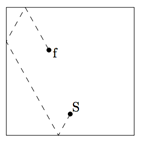

## 문제

As a ninja, Saito Hajime has to fight many opponents who are foolish enough to challenge his might. Most of these opponents fall easily to Saito’s great martial arts techniques and ninjitsus5. From time to time however, the great Saito Hajime has to take care of a particularly powerful and skilled foe6 . This foe usually enters the combat after several dozens of his/her minions have been defeated by Saito. Saito always encounters such foes in empty rectangular rooms.

In order to defeat such a powerful foe, Saito has to perform a special ninjitsu known as Saito Hajime’s Zero Stance Ultimate Finishing Strike. This strike involves hitting his foe by performing a flying kick that starts at Saito’s current position. Of course, a simple flying kick will not be enough to defeat a powerful foe, but Saito can improve the power of his strike by bouncing off several walls before hitting his foe. Every bounce gives his attack more power, so that with enough bounces any foe can be defeated. Note that Saito always bounces off a wall according to the rule “angle of incidence is equal to the angle of reflection”.

Saito knows how often he has to bounce off a wall to defeat a particular foe. He must be careful though; if his attack takes too long, his foe might be able to dodge his attack. Therefore, the distance traveled by Saito while performing his strike must be as short as possible. Can you figure out how often Saito will hit each of the four walls while performing his strike?

Figure 3: Saito (S) hits foe (f) after 3 bounces.

5A ninjitsu is a technique that comes from the ninjas inner power called Qi.

6In the age of ninjas, such a foe was commonly referred to as Boss.

## 입력

The first line of the input contains a single number: the number of test cases to follow. Each test case has the following format:

* A line with three positive integer numbers L, W (3 ≤ L, W ≤ 100), and B (0 ≤ B ≤ 105): the length and width of the room, and the number of bounces necessary to defeat his foe.
* A line with two positive integer numbers xS (0 < xS < L) and yS (0 < yS < W): the starting coordinates of Saito.
* A line with two positive integer numbers xf (0 < xf < L) and yf (0 < yf < W): the coordinates of the foe.

The bottom left corner of the room is at (0, 0). You can assume that Saito and his foe do not start at the same position. If Saito hits a corner of the room, this counts as two bounces, one for each wall. Also, Saito is able to fly over his foe while performing his strike.

## 출력

For every test case in the input, the output should contain:

* One line with four integers: the number of times Saito has hit the north, east, south, and west wall, respectively. The north wall is in the positive y-direction and the east wall is in the positive x-direction. In case there are multiple possibilities, you must output all of them ordered lexicographically, each on a separate line.
* One line containing the number 0.
