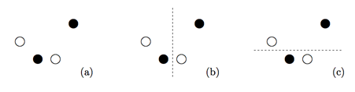
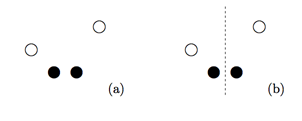

## 문제

Frans is celebrating his birthday. At an exclusive baker’s shop, he has bought two delicious pies, of different types. He cuts each pie into a number of pieces. At coffee time, he invites his colleagues for a piece of pie, but after the celebration, some pieces are left over. In fact, 2N pieces are left over: N pieces of each pie, and N happens to be even. Frans does not want to take all remaining pieces back home, so he decides to share them with a colleague who is fond of pie too.

Now Frans wonders how to split the 2N remaining pieces, which seem to be randomly distributed over the table, in two. A simple way to achieve this would be to stretch a cord over the table, in a straight line. The pieces at one side of the cord are for Frans, the pieces at the other side are for the colleague. There is, however, a constraint. Both Frans and his colleague should take home ½N pieces of the first pie, and ½N pieces of the second pie. Is this possible with the cord trick? And if so, how many ways are there to do this? Of course, this depends on the positions of the 2N pieces on the table.

For example, let N = 2, and let the pieces of one pie be depicted by closed circles, and the pieces of the other pie by open circles. In the configuration of Figure 1(a), there are two possible divisions, as indicated in Figure 1(b) and Figure 1(c).

Figure 1: Two valid divisions of four pieces.

On the other hand, in the configuration of Figure 2(a), there is only one valid division, as indicated in Figure 2(b).

Figure 2: One valid division of four pieces.

To simplify things, we assume that no three pieces of pie are on the same line. This implies in particular that no two pieces of pie occupy the same position. Moreover, we assume that each piece is infinitely small.

## 입력

The first line of the input contains a single number: the number of test cases to follow. Each test case has the following format:

* One line with an even integer N, satisfying 2 ≤ N ≤ 1, 000.
* N lines, each with two integers x and y, satisfying −10, 000 ≤ x,y ≤ 10, 000: the x- and y-coordinates of a piece of the first pie.
* N lines, each with two integers x and y, satisfying −10, 000 ≤ x,y ≤ 10, 000: the x- and y-coordinates of a piece of the second pie.

Integers on the same line are separated by a single space.

## 출력

For every test case in the input, the output should contain a single number, on a single line: the number of ways to split the 2N pieces of pie in two, by stretching a cord over the table, such that at each side of the cord, there are ½N pieces of the first pie and ½N pieces of the second pie.
