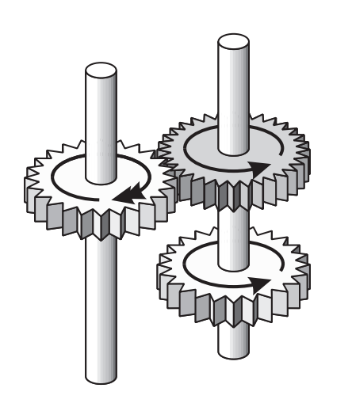

## 문제

Jake decided to take the gearbox of his car apart and put it back together for ‘learning purposes’. A gearbox is a box containing many gears, cogs and sprockets (as well as several springs and pinions). All these parts are connected together in intricate ways. Consequently, he is not completely sure if every part is in the correct position again.

All gears are placed on metal rods; when one gear on a rod turns, they all turn by an equal angle. The rods are connected by springs and plastic bars, but Jake is pretty sure he has that part right. The cogs and sprockets are not connected to anything, they are free to rattle around in the box. This may be a bit strange, but a quick Google search reveals that this is customary for gearboxes of this type.

The only problem is that some gears are interlocked, which could cause the main drive shaft to jam. The gearbox uses modern InfiniTeethTM gears, which means that it is impossible to count the number of teeth on a gear. All gears have a type number, and gears of the same type have the same number of teeth. According to the manual (which Jake should have read before he started this mess) all rods should be able to turn, regardless of the number of teeth on each type of gear. So Jake concludes that if this is true for his gearbox it is definitely assembled correctly.

Figure 1: Two rods with three gears. The top two gears are interlocked, the two rods turn in opposite directions. If the dark gear has 36 teeth and the light gears have 24 teeth, then the left rod turns 1.5 times faster.

## 입력

On the first line of the input is a positive integer, the number of test cases. Then for each test case:

* A line with three integers ng, nr and ni (all < 105), the number of gears, rods and interlockings.
* ng lines, each containing two integers 0 < ti < 100 and 0 ≤ ri < nr, the type number of gear i and the index of the rod it is on respectively.
* ni lines, each containing two integers 0 ≤ aj < bj < ng, indicating that gears aj and bj are interlocked.

## 출력

For each test case:

* One line containing the text “ok” if the gearbox is definitely assembled correctly, and “jammed” otherwise.
