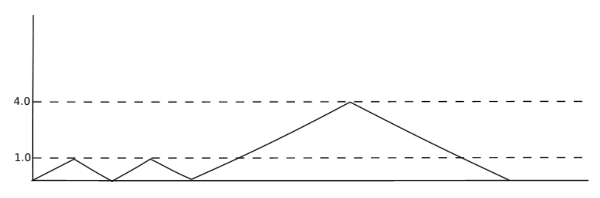

## 문제

The local skating park has been given a financial incentive by the city to make the park interesting for skaters of all levels. The park wants to use the incentive to build a series of ramps, somewhat resembling a mountain range. When talking to some of the volunteers in the committee responsible for the project, you find out they're having difficulties deciding about the best configuration of the ramps. They know the number of ramps to be built, and for each ramp they agree on the range of the height for that ramp. They are still discussing exactly how high each ramp should be, since they can't afford to have them all at their highest, but they do want to spend all of the budget. This is the most important issue in the debate: they can't agree whether they want the differences between the ramps to be small, to give the full ride a more consistent feeling, or as big as possible, to create a more diverse set of challenges.

You also notice they don't really have a good idea what the possibilities are, leaving them stranded in 'what-if' discussions. You decide to help them out by showing them the options they have, both the ones where the difference between the highest and lowest ramp is kept as small as possible, as well as the one where that difference is as much as possible. Since the committee is mainly bickering over the allowable differences, you decide to start out by just presenting them the minimum and maximum difference between the highest and lowest ramp. Luckily, the park has a lot of space, so you won't need to take the placement of the ramps into account. All ramps have the same inclination, which is such that a ramp of height h will have a length 4h (measured flat, not over the ramp).

## 입력

* The first line of input consists of the integer number n, the number of test cases;
* Then, for each test case:
  + A line with the integer number r (2 ≤ r ≤ 10000), the number of ramps the park will place;
  + A line with the integer number m (0 ≤ m ≤ 200000000 = 2×108), the number of cubic meters of concrete the park has money for;
  + r lines with two numbers, l and t (0.00 ≤ l ≤ t ≤ 100.00), separated by one space, the minimum and maximum height in meters of the r-th ramp.

You may assume all ramps are made entirely of concrete, and shaped as 1 meter wide prisms, with a triangle with two equal sides as base. A series of ramps within the given constraints and using all concrete is guaranteed to exist.

## 출력

For each test case, the output contains one line with two numbers, separated by one space: the minimum difference between the highest and lowest ramp and the maximum difference between the highest and the lowest ramp. These numbers are rounded to two decimals.

## 힌트

